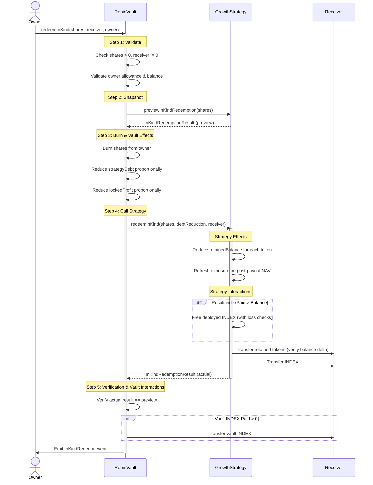

# In-Kind Redemption Design

## Scope

`redeemInKind` is an optional Growth-vault extension. Standard ERC-4626 `redeem` and `withdraw` remain INDEX-only and may liquidate retained assets through the existing strategy withdrawal path.

RobinVault remains asset-agnostic. It coordinates share validation, burning, and pro-rata debt/INDEX accounting, but never stores, inspects, or interprets individual stock tokens. GrowthStrategy owns the retained-token list, proportional stock allocation, retained-balance updates, exposure updates, and token transfers.

---

## Allocation and Rounding

For a partial redemption, each payout uses:
$$\text{payout} = \lfloor \frac{\text{assetBalance} \times \text{shares}}{\text{totalSupplyBefore}} \rfloor$$
This floor-rounding prevents overpayment; any rounding dust remains in the portfolio for the benefit of remaining shareholders. 

For a full redemption (`shares == totalSupplyBefore`), the implementation bypasses pro-rata division and explicitly transfers the **entire remaining balance** of strategy-held INDEX and every retained token. This prevents division dust from being permanently stranded in the strategy.

---

## Sequence of Execution (CEI Flow)

To ensure maximum safety against reentrancy and manipulation, the redemption sequence follows a strict check-effects-interactions (CEI) pattern across both contracts:

1. **Validate**: Check that shares and receiver are valid, and verify caller permissions/allowances.
2. **Snapshot**: Snapshot total shares, vault INDEX, strategy debt, locked profit, and strategy retained balances. Computations are based strictly on these snapshots before any state edits.
3. **Burn**: Burn vault shares and reduce the vault's `strategyDebt` and `lockedProfit` proportionally.
4. **Strategy Effects**: Strategy updates `retainedBalance` for each token, and refreshes token/category exposures against the post-payout NAV.
5. **Interactions**: Strategy transfers the pro-rata retained tokens and strategy INDEX. Receiver balance deltas are verified to protect against fee-on-transfer or rebasing tokens. Vault transfers its pro-rata vault INDEX portion.
6. **Verify and Emit**: Vault verifies that the actual strategy payout matches the preview, then emits the canonical event.

---

## Token Compatibility Requirements

The in-kind redemption capability assumes standard ERC-20 token behavior:
- **Fee-on-Transfer Tokens**: Explicitly unsupported. If a token deducts fees on transfer, the balance-delta check in `redeemInKind` will detect the deficit and revert the transaction with `FeeOnTransferDetected`.
- **Rebasing/Hook-based Tokens**: Unsupported. Tokens with rebasing logic or callback hooks (e.g., ERC-777) could introduce reentrancy risks or drift accounting invariants and are not approved for retention.

---

## Accounting Invariants

Every redemption must satisfy three core invariants (verified under test):

1. **NAV Conservation Invariant**:
   $$\text{preNAV} = \text{postNAV} + \text{redeemedValue} \pm \text{floor dust}$$
   The sum of vault INDEX, strategy INDEX, and retained stock value before redemption must equal the post-redemption NAV plus the value received by the owner, subject only to floor-rounding dust.
   
2. **Debt Proportionality Invariant**:
   $$\frac{\text{sharesBurned}}{\text{totalSupplyBefore}} \approx \frac{\text{debtReduction}}{\text{strategyDebtBefore}}$$
   The vault debt reduction must match the burnt ownership fraction exactly (within 1 wei).
   
3. **Triple Payout Consistency**:
   For each token in the redemption:
   $$\text{preview amount} = \text{emitted event amount} = \text{receiver balance delta}$$
   This guarantees that off-chain indexers, event logs, and on-chain balances remain perfectly synchronized.

---

## Custom Errors & Events

### RobinVault
- `event InKindRedeem(address indexed owner, address indexed receiver, uint256 shares, uint256 indexPaid, address[] retainedTokens, uint256[] retainedAmounts)`
- `error ZeroShares()`: Thrown when trying to redeem 0 shares.
- `error ZeroAddress()`: Thrown when receiver is address(0).
- `error InKindRedemptionNotSupported(address strategy)`: Thrown when strategy is unset or does not implement in-kind interface.
- `error InKindRedemptionMismatch()`: Thrown if actual payout does not match preview.

### GrowthStrategy
- `event GrowthInKindRedeemed(address indexed receiver, uint256 shares, uint256 indexPaid, address[] tokens, uint256[] amounts)`
- `error ZeroReceiver()`: Thrown when receiver is address(0).
- `error InKindSupplyInvalid()`: Thrown if supply is zero or shares exceed supply.
- `error FeeOnTransferDetected(address token, uint256 expected, uint256 received)`: Thrown when transfer delta is lower than requested amount.

---

## Production & Deployment Notes

### EIP-170 Status
`GrowthStrategy` remains below the EIP-170 runtime size limit after this implementation. The deployment size has been verified using `forge build --sizes`. This prevents future regressions regarding deployability.

### Backward Compatibility
The implementation does not modify:
- ERC4626 deposits
- ERC4626 withdrawals
- CoreStrategy
- Harvest pipeline
- Reward processing
- Existing accounting

The feature exists only as an optional extension for advanced users.

### Unsupported External Integrations
Current implementation assumes:
- The official Index Finance integration is still provisional.
- Production oracle addresses are not finalized.
- Production DEX routes remain external configuration.

These are deployment concerns rather than protocol concerns.

### Gas Impact
- **Normal redemption**: Unchanged.
- **In-kind redemption**: Linear gas cost in relation to the retained asset count, due to the need to transfer each asset and update its post-redemption exposure.

### Time Complexity
- `previewInKindRedeem`: $O(n)$
- `redeemInKind`: $O(n)$
*(where $n$ is the number of retained assets)*

### Practical Limits
Practical portfolio size depends on block gas limits. If a portfolio keeps a large number of retained assets (e.g., 200+), redeeming becomes extremely expensive and risks exceeding block gas limits.

### Operational Requirements
Before deployment:
- Replace the provisional Index Finance ABI.
- Verify oracle feeds and DEX routes.
- Run mainnet fork tests.
- Complete an external audit.

> **Note on Oracles**: The in-kind redemption UX *does* rely directly on valid on-chain oracles. While proportional token distribution is determined strictly by balances (not valuation), the protocol must recalculate post-redemption category exposure (`_refreshExposure`) after the withdrawal. This exposure recalculation requires fresh oracle valuations. Thus, a paused or stale oracle will revert in-kind redemptions.
