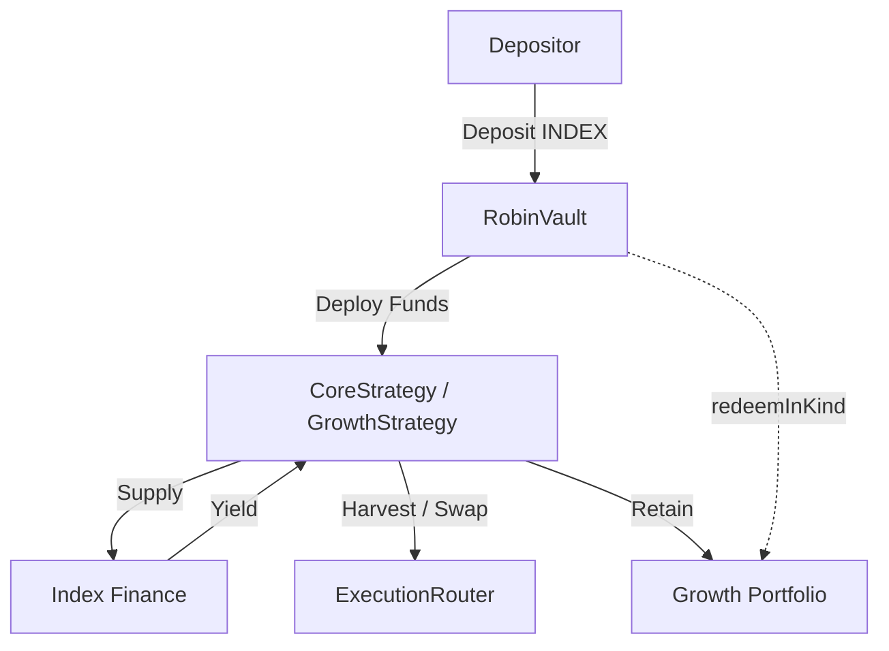

# Robin Harvest Contracts

Foundry workspace for Robin Harvest, an ERC-4626 yield optimizer targeting Robinhood Chain and Index Finance (INDEX).

## Production Readiness

Current repository status:
✅ Feature complete
✅ Integration tests
✅ Invariant tests
✅ Slither
⚠️ External integrations pending
⚠️ External audit pending
❌ Not approved for production deployment

## Status

| Phase | Scope | Status |
|---|---|---|
| 1–5 | Bootstrap, types, interfaces, mocks, AccessManager | Complete |
| 6 | RobinVault (ERC-4626, debt, profit lock, in-kind hook) | Complete |
| 7–9 | OracleRegistry, RewardRegistry, ExecutionRouter | Complete |
| 10–11 | StrategyBase, CoreStrategy (provisional Index Finance ABI) | Complete |
| 12–13 | GrowthStrategy (retention, liquidation order, conservative NAV, category policy) | Complete |
| 14 | Optional In-Kind Redemption UX, integration, and system tests | Complete |
| 15 | Deployment scripts and operational docs | Implementation complete. Production deployment remains blocked on final external protocol parameters (official Index Finance contracts, production oracle feeds, DEX routes, governance configuration, and external audit). |

## Features

- ERC-4626 compliant vault architecture
- Core and Growth yield strategies
- Oracle-backed reward valuation
- Constrained execution router
- Configurable reward registry
- Conservative NAV accounting
- Category exposure enforcement
- Optional in-kind redemption
- Performance + management fee accounting
- Timelocked strategy migration
- Profit smoothing
- AccessManager-based governance

## Protocol Flow



### Redemption UX
- **Standard ERC4626 `redeem()`**: INDEX only (liquidates retained assets as necessary).
- **Optional `redeemInKind()`**: Proportional INDEX + retained stock rewards.

## Security Assumptions

Robin Harvest assumes:
- trusted governance
- approved reward tokens
- approved oracle feeds
- approved DEX adapters
- standard ERC20 retained assets
- non-malicious external protocols

**Explicitly Unsupported:**
- fee-on-transfer tokens
- rebasing tokens
- ERC777
- callback-enabled wrappers
- transfer-tax tokens

## External Audit Scope

The intended external audit includes:
- Vault accounting
- Strategy accounting
- Oracle integration
- Reward processing
- Execution router
- In-kind redemption
- Fee accounting
- Strategy migration

## Launch Checklist

Before production:
- [ ] Official Index Finance ABI
- [ ] Production oracle feeds
- [ ] Production DEX routes
- [ ] Governance multisig
- [ ] Timelock configuration
- [ ] Mainnet fork tests
- [ ] External audit
- [ ] Audit remediation

## Current Limitations

- Provisional Index Finance integration.
- Production addresses pending.
- LP strategy not yet implemented (blocked on LP type confirmation).

## Toolchain & Tests

- Foundry (Solidity `0.8.25`, EVM target `paris`)
- OpenZeppelin Contracts `v5.6.1`
- forge-std `v1.9.7`

Current repository test suite includes:
- Unit tests
- Integration tests
- Stateful invariant tests
- Fuzz tests

## Commands

```sh
forge fmt --check
forge build --sizes
forge test
```
CI runs formatting, build with size report, tests, and Slither.

## Deployment

Deployment consists of:
1. Deploy contracts
2. Governance initialization
3. Registry configuration
4. Strategy wiring
5. Deployment verification
6. Testnet validation
7. Production enablement

See [docs/DEPLOYMENT.md](./docs/DEPLOYMENT.md) for launch procedures.
