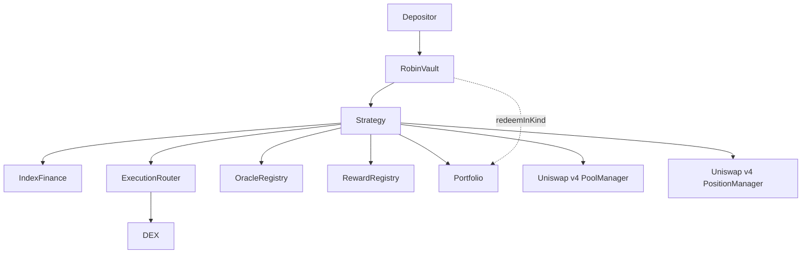

# Robin Harvest Contracts


Foundry workspace for Robin Harvest, an ERC-4626 yield optimizer targeting Robinhood Chain and Index Finance (INDEX).

## Version & Audit Status

**Current Version:** `v1.2.0`  
**Status:** Feature Complete / Pre-Audit

> ⚠️ **Audit Status:** No external audit has been completed. The protocol should be considered experimental until the launch checklist is fully satisfied.

## Production Readiness

Current repository status:
✅ Feature complete
✅ Integration tests
✅ Invariant tests
✅ Slither
⚠️ External integrations pending
⚠️ External audit pending
❌ Not approved for production deployment

## Quick Start

```bash
git clone https://github.com/Robin-Harvest/robin-harvest-contracts.git
cd robin-harvest-contracts

# Install dependencies
forge install

# Compile contracts
forge build

# Run test suite
forge test

# Run static analysis
slither .
```

## Status

| Phase | Scope | Status |
|---|---|---|
| 1–5 | Bootstrap, types, interfaces, mocks, AccessManager | Complete |
| 6 | RobinVault (ERC-4626, debt, profit lock, in-kind hook) | Complete |
| 7–9 | OracleRegistry, RewardRegistry, ExecutionRouter | Complete |
| 10–11 | StrategyBase, CoreStrategy (provisional Index Finance ABI) | Complete |
| 12–13 | GrowthStrategy (retention, liquidation order, conservative NAV, category policy) | Complete |
| 14 | Optional In-Kind Redemption UX, integration, and system tests | Complete |
| 15 | Deployment scripts and operational docs | Complete |
| 16 | rhINDEX-CL Strategy (Uniswap v4 concentrated liquidity, oracle-constrained swaps, position management, fuzz/invariant suite) | Complete |

## Features

- ERC-4626 compliant vault architecture
- **Three Vault Strategy Products**: Core (Lending Yield), Growth (Stock Token Retention), and CL (Uniswap v4 concentrated liquidity)
- Policy-driven single-pool position ranges with strategy-owned tick validation
- Oracle-constrained swaps and hookless v4 PositionManager action plans
- Oracle-backed reward valuation & liveness-first accounting policy
- Constrained execution router with max deviation protection
- Configurable reward registry
- Conservative NAV accounting
- Category exposure enforcement
- Optional in-kind redemption for Growth vaults
- Performance + management fee accounting
- Timelocked strategy migration
- Linear profit unlocking / lockup smoothing
- AccessManager-based governance

## Supported Standards

- **ERC-20**: Standard token integration for all assets and rewards.
- **ERC-4626**: Tokenized vault standard for deposits and redemptions.
- **EIP-170**: Compliant runtime bytecode size for all deployed contracts.

## Protocol Flow



### Strategy Products
- **Core (`CoreStrategy`)**: Deposit INDEX into Index Finance → sell all rewards → compound.
- **Growth (`GrowthStrategy`)**: Deposit INDEX into Index Finance → sell, retain, or ignore rewards → in-kind redemption.
- **CL (`ConcentratedLiquidityStrategy`)**: Oracle-checked allocation → mint/manage v4 position NFTs → collect and optionally compound fees.

### Redemption UX
- **Standard ERC4626 `redeem()`**: INDEX only (liquidates retained assets or LP positions as necessary).
- **Optional `redeemInKind()`** (Growth only): Proportional INDEX + retained stock rewards.

## Backward Compatibility & Gas Impact

The implementation is structured as an optional extension and does not modify or disrupt existing core accounting:
- Standard ERC4626 deposits and withdrawals remain unaffected.
- The CoreStrategy, Harvest pipeline, and Reward processing flow identically.
- Gas overhead is strictly isolated to the users who opt-in to `redeemInKind()`, meaning standard users pay no additional penalty.

## Security Assumptions

Robin Harvest assumes:
- trusted governance
- approved reward tokens
- approved oracle feeds
- approved DEX adapters
- standard ERC20 retained assets
- non-malicious external protocols

**Oracle Valuation & Liveness Policy**:
- Protocol liveness is prioritized over temporary NAV precision during price feed disruptions.
- If an oracle feed for a retained token is stale, paused, or invalid, the token's value is safely treated as `0` during NAV calculation rather than reverting vault operations.
- Operators receive `UnpriceableAssetSkipped` event alerts during liquidation routines and must treat unpriced feeds as operational alerts requiring oracle remediation.

**Explicitly Unsupported:**
- fee-on-transfer tokens
- rebasing tokens
- ERC777
- callback-enabled wrappers
- transfer-tax tokens

## External Audit Scope

The intended external audit includes:
- Vault accounting
- Strategy accounting
- Oracle integration
- Reward processing
- Execution router
- In-kind redemption
- Fee accounting
- Strategy migration

## Launch Checklist

Before production:
- [ ] Official Index Finance ABI
- [ ] Production oracle feeds
- [ ] Production DEX routes
- [ ] Governance multisig
- [ ] Timelock configuration
- [x] Robinhood Chain V4 fork tests
- [ ] Static-analysis findings and coverage gate
- [ ] External audit
- [ ] Audit remediation

Hardening decisions, invariant documentation, and audit gates are tracked in
[`docs/SECURITY_HARDENING.md`](docs/SECURITY_HARDENING.md),
[`docs/INVARIANTS.md`](docs/INVARIANTS.md), and
[`docs/AUDIT_READINESS.md`](docs/AUDIT_READINESS.md).

## Current Limitations & External Integrations

Current implementation assumes:
- Official Index Finance integration is still provisional.
- Production oracle addresses are not finalized.
- Production DEX routes remain external configuration.
- CL V1 is hookless, single-pool, and uses an internal observation ring because v4 hookless pools have no native TWAP.

## Toolchain & Tests

- Foundry (Solidity `0.8.25`, EVM target `cancun`)
- OpenZeppelin Contracts `v5.6.1`
- forge-std `v1.16.2` (pinned in `foundry.lock`)
- Uniswap v4 core & periphery (pinned via Git submodules in `foundry.lock`)

Current repository test suite includes:
- **157 passed unit, integration, fuzz, and stateful invariant tests** (0 failed, 2 skipped live-RPC tests across 16 test suites)

> ℹ️ **Note on Test Coverage & via-IR:** Because Uniswap v4 planning and tick math require solc `--via-ir` compilation, automated line coverage generation (`forge coverage`) exceeds Yul optimizer stack limits on large strategy contracts. Verification assurance relies on comprehensive unit, fork, gas, and stateful invariant suites (see [docs/STATIC_ANALYSIS.md](./docs/STATIC_ANALYSIS.md)).

## Commands

```sh
forge fmt --check
forge build --sizes
forge test
```
CI runs formatting, build with size report, tests, and Slither. 

> **Note on EIP-170**: `GrowthStrategy` and all other core contracts remain below the EIP-170 runtime size limit (24.576 kb) after implementation. Deployment sizes are continuously verified in CI using `forge build --sizes`.

## Deployment

Deployment consists of:
1. Deploy contracts
2. Governance initialization
3. Registry configuration
4. Strategy wiring
5. Deployment verification
6. Testnet validation
7. Production enablement

See [DEPLOYMENT.md](./DEPLOYMENT.md) for launch procedures.

## License

MIT
