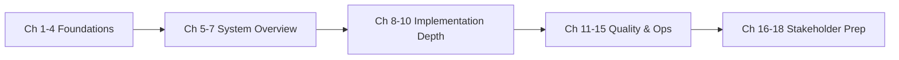

# Chapter 1 — Introduction

## 1.1 What Is Robin Harvest?

**Robin Harvest** is an on-chain **yield optimizer** built for **Robinhood Chain** and **Index Finance (INDEX)**. At its core, it is a set of **ERC-4626 tokenized vaults** that:

1. Accept deposits in **INDEX** (the vault asset).
2. Deploy capital into **Index Finance** through attached **strategies**.
3. **Claim, value, and process reward tokens** (including tokenized stocks) according to governance-configured policy.
4. **Report gains and losses** back to the vault, which updates share price (NAV per share).
5. Allow users to **withdraw INDEX** (standard ERC-4626) or, in the Growth product, optionally **redeem in kind** (proportional INDEX + retained stock tokens).

The repository is named `robin-harvest-contracts`. Current version: **v0.1.0-alpha**. Status: **feature complete / pre-audit**. The README explicitly states: **not approved for production deployment**.

---

## 1.2 The Three Products

Robin Harvest ships three vault/strategy pairs from a single deployment script:

| Product    | Vault symbol | Strategy         | Reward policy                                                                             |
| ---------- | ------------ | ---------------- | ----------------------------------------------------------------------------------------- |
| **Core**   | `rhINDEX-C`  | `CoreStrategy`   | Sell all rewards to INDEX; never retain stocks                                            |
| **Growth** | `rhINDEX-G`  | `GrowthStrategy` | Sell, ignore, or **retain** rewards per `RewardRegistry`; optional **in-kind redemption** |
| **LP**     | `rhINDEX-LP` | `LpStrategy`     | Optimal-ratio swap into DEX LP pool; Gauge staking; auto-compound all rewards into LP     |

All three vaults share:

- `OracleRegistry` — validated price feeds
- `RewardRegistry` — per-token reward policy
- `ExecutionRouter` — constrained DEX swaps
- `AccessManager` — role-based governance

Each vault has its own `RobinAccountant` for fee assessment.

---

## 1.3 What Problem Does It Solve?

Index Finance users earn **reward tokens** (often tokenized equities) when participating in index products. Managing those rewards manually — claiming, swapping, rebalancing, tax-lot tracking — is operationally heavy.

Robin Harvest automates:

- **Capital deployment** into Index Finance
- **Reward claiming** on a keeper schedule
- **Deterministic reward disposition** (sell / retain / ignore)
- **Conservative NAV accounting** for retained assets
- **Share-based pooling** so many depositors share one optimized portfolio
- **Optional in-kind exit** for Growth users who want stock exposure without forced liquidation

---

## 1.4 Who Should Read This Handbook?

| Audience                      | Goal                                                            |
| ----------------------------- | --------------------------------------------------------------- |
| **Founders**                  | Explain business value, architecture tradeoffs, launch blockers |
| **Senior Solidity engineers** | Implement changes safely; understand every function             |
| **Auditors**                  | Threat model, invariants, accounting edge cases                 |
| **Investors**                 | Risk, trust assumptions, production readiness                   |
| **Contributors**              | Onboard to repo structure and conventions                       |
| **Recruiters / interviewers** | Assess candidate depth on this codebase                         |

No prior blockchain knowledge is assumed. Concepts build incrementally.

---

## 1.5 Source of Truth Hierarchy

When sources conflict, use this precedence:

1. **Deployed bytecode on chain** (production)
2. **Solidity source in** `src/` (this repository)
3. `DESIGN.md`**,** `docs/`**, README** (intent and UX; may lag implementation)
4. `OPEN_QUESTIONS.md` (unresolved external parameters)

Known doc vs implementation notes:

| Topic                            | Documentation                                               | Implementation                                                | Authoritative                                            |
| -------------------------------- | ----------------------------------------------------------- | ------------------------------------------------------------- | -------------------------------------------------------- |
| Phase 6 in-kind stubs            | `PHASE_6_10_FUNCTION_REVIEW.md` says `redeemInKind` reverts | `RobinVault.redeemInKind` is **fully implemented** for Growth | **Implementation** (Phase 14 completed)                  |
| Eligibility metric               | Events mention "INDEX balance"                              | `isEligible()` uses `totalAssets()` (net managed value)       | **Implementation**; DESIGN.md explains intent            |
| Strategy `freeFunds(maxLossBps)` | Architecture sketch included maxLoss at strategy            | Max loss enforced in **RobinVault** only                      | **Implementation** (`IRobinStrategy.freeFunds(uint256)`) |

---

## 1.6 Production Status and Launch Blockers

From `README.md` and `OPEN_QUESTIONS.md`:

**Complete:**

- ERC-4626 vault with debt accounting, locked profit, max-loss withdrawals
- Core, Growth, and LP strategies
- LP: optimal single-sided swap, DEX liquidity provisioning, Gauge staking, auto-compounding
- Oracle, reward, and execution infrastructure
- In-kind redemption (Growth)
- Deployment/configure/validate scripts
- Unit, integration, invariant (Core/Growth + LP), fuzz tests
- CI: build sizes, tests, Slither

**Pending before production:**

- Official Index Finance ABI and addresses
- Production oracle feeds and DEX routes
- Governance multisig and timelock handoff
- Mainnet fork tests
- **External audit** and remediation

**Explicitly unsupported token types:**

- Fee-on-transfer
- Rebasing
- ERC-777 / callback wrappers
- Transfer-tax tokens

---

## 1.7 How This Book Is Organized

- **Chapters 2–4** teach blockchain, Solidity, and DeFi concepts *before* Robin Harvest specifics.
- **Chapters 5–7** describe what the protocol is and how the repo is laid out.
- **Chapters 8–10** cover execution flows, mathematics, and every contract function.
- **Chapters 11–15** cover testing, security, deployment, CI, and readiness.
- **Chapters 16–18** prepare you for founder conversations and interviews.

See [study-roadmap.md](./study-roadmap.md) for time estimates.

---

## 1.8 Key Terminology Preview

| Term                   | Meaning in Robin Harvest                                             |
| ---------------------- | -------------------------------------------------------------------- |
| **INDEX**              | ERC-20 vault asset; accounting denomination                          |
| **Vault**              | `RobinVault` — ERC-4626 share token over INDEX                       |
| **Strategy**           | Contract that deploys INDEX, claims rewards, reports to vault        |
| **strategyDebt**       | Vault's book value of assets sent to strategy                        |
| **lockedProfit**       | Reported gains excluded from `totalAssets()` until linearly unlocked |
| **Harvest**            | Keeper-triggered reward processing + NAV report                      |
| **In-kind redemption** | Non-ERC-4626 exit: proportional INDEX + retained stocks              |

Full definitions: [16-glossary.md](./16-glossary.md).

---

## 1.9 Next Steps

If you have **zero blockchain background**, continue to [02-blockchain-fundamentals.md](./02-blockchain-fundamentals.md).

If you know Ethereum and want the protocol story first, skip to [05-project-overview.md](./05-project-overview.md) — but return to Chapters 2–4 when you hit unfamiliar mechanics.