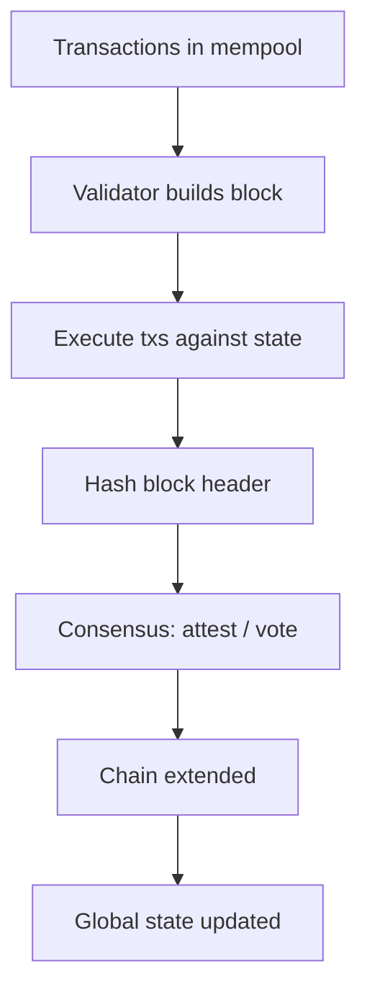
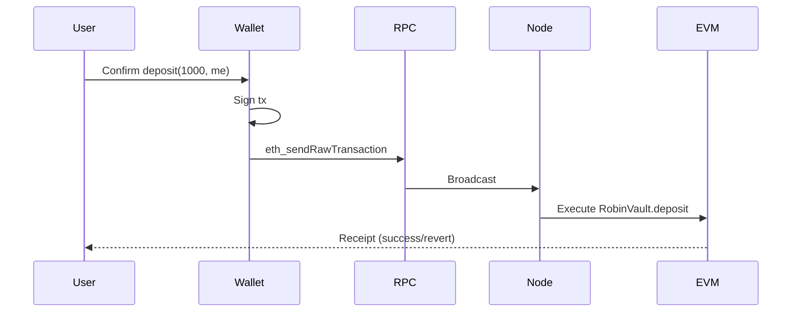

# Chapter 2 — Blockchain Fundamentals

This chapter teaches blockchain from first principles. No prior knowledge is assumed. Every concept is explained before it is used in later Robin Harvest chapters.

---

## 2.1 What Is a Blockchain?

### What it is

A **blockchain** is a **distributed ledger**: a database replicated across many computers where new data is appended in **blocks** linked by cryptographic hashes. Each block contains a batch of **transactions**. Changing old data breaks the hash chain, making tampering detectable.

### Why it exists

Traditional databases require trusting a single operator (a bank, a company). Blockchains allow **many mutually distrusting parties** to agree on a shared history of state changes without a central administrator — or with reduced trust in any one node.

### How it works internally

1. A user constructs a **transaction** (e.g., "transfer 10 tokens from A to B").
2. The transaction is broadcast to a **network of nodes**.
3. **Validators** (or miners) select transactions, execute them against current state, and propose a new block.
4. The network reaches **consensus** on which block becomes canonical.
5. State updates (balances, contract storage) are committed; the block is **immutable** in practice (extremely expensive to rewrite).



### Why Robin Harvest uses it

Robin Harvest is a **smart contract protocol** on **Robinhood Chain** (EVM-compatible). Deposits, share minting, strategy deployment, reward harvesting, and withdrawals are all **on-chain state transitions** enforced by validator consensus. Users do not rely on Robin Harvest's server to honor withdrawals — they rely on **contract code + chain finality**.

### Alternatives

| Alternative | Tradeoff |
|---|---|
| Centralized database + API | Faster, cheaper; single point of failure and trust |
| Permissioned blockchain | Known validators; less censorship resistance |
| Layer-2 rollups | Cheaper execution; extra bridge/trust assumptions |

### Security implications

- **Finality**: Once confirmed, reversing transactions requires chain reorganization (varies by chain).
- **Transparency**: All Robin Harvest vault state is publicly readable.
- **Irreversibility**: Buggy contract code cannot be "patched" without upgrade mechanisms (Robin Harvest V1 contracts are **not upgradeable**).

---

## 2.2 Why Blockchains Exist — The Trust Problem

### What it is

Blockchains address **trust minimization**: participants want shared rules enforced without delegating full control to one party.

### Why it exists

Financial agreements historically required **legal systems and intermediaries**. Smart contracts encode rules in software that executes identically on every node.

### Robin Harvest connection

When you deposit INDEX into `RobinVault`, you trust:
1. The **Solidity code** at the deployed address
2. The **chain** to execute it faithfully
3. **Governance** not to misconfigure oracles/routes (human/process trust remains)

You do **not** need to trust an off-chain database to credit your shares — shares are ERC-20 tokens in your wallet.

---

## 2.3 Bitcoin (Brief Context)

### What it is

**Bitcoin** (2009) introduced a blockchain for **peer-to-peer value transfer** without a central issuer. Consensus: **Proof of Work (PoW)**. Scripting is intentionally limited — not a general application platform.

### Why it matters for Robin Harvest

Robin Harvest is **not** on Bitcoin. It targets an **EVM chain** where **Turing-complete smart contracts** (Solidity) are first-class. Bitcoin illustrates the origin of decentralized ledgers; Ethereum extends the model to programmable logic.

---

## 2.4 Ethereum and the EVM

### What it is

**Ethereum** is a blockchain with the **Ethereum Virtual Machine (EVM)** — a stack-based VM that executes **bytecode** compiled from high-level languages (Solidity, Vyper).

### Why it exists

Developers needed **general-purpose programs** on-chain: tokens, vaults, DEXs, governance.

### How the EVM works internally

- **Accounts** hold **balance** (native ETH or chain native token) and **storage** (for contracts).
- Each **opcode** (ADD, SSTORE, CALL, etc.) has a **gas cost**.
- Execution is **deterministic**: same inputs + same state → same outputs on every node.
- Contracts communicate via **message calls** (CALL, DELEGATECALL, STATICCALL).

### EVM version: Paris

Robin Harvest's `foundry.toml` sets:

```toml
evm_version = "paris"
```

**Paris** is an EVM hard fork level (post-Merge, pre-Cancun). It **does not** include Cancun opcodes like `mcopy`. This is why the repo implements `ERC4626Paris` locally instead of importing OpenZeppelin's latest ERC-4626 (which uses Cancun-only helpers).

### Why Robin Harvest uses EVM

- **Index Finance**, DEX routers, and oracles on Robinhood Chain expose **EVM interfaces**.
- **Tooling**: Foundry, Slither, OpenZeppelin, standard ERC ABIs.
- **Composability**: INDEX, vault shares, and strategies interact as contracts.

### Alternatives

| Platform | Tradeoff |
|---|---|
| Solana (SVM) | Different account model; not compatible with Solidity/EVM tooling |
| Move (Aptos/Sui) | Resource-oriented safety; smaller DeFi ecosystem for INDEX |
| Cosmos SDK chains | App-specific; bridge to EVM assets |

### Security implications

- **Reentrancy**, **integer issues** (mitigated in Solidity 0.8+), **oracle manipulation** are EVM-specific threat classes Robin Harvest addresses in code (see [12-security.md](./12-security.md)).

---

## 2.5 Accounts

### What it is

On EVM chains, everything is an **account** (20-byte address). Two types:

| Type | Controlled by | Can have code? | Can initiate txs? |
|---|---|---|---|
| **EOA** | Private key | No | Yes |
| **Contract** | Code at address | Yes | Only via incoming calls |

### Why it exists

Clear separation between **human/software signers** (EOAs) and **autonomous programs** (contracts).

### How it works internally

- **EOA**: `ecrecover` validates ECDSA signature on transactions.
- **Contract**: No private key; logic in bytecode runs when called.
- **Nonce**: Prevents replay; increments per sent tx (EOA) or per CREATE (contract).

### Robin Harvest usage

| Address role | Account type |
|---|---|
| Depositor / user | EOA or smart wallet |
| `RobinVault`, `GrowthStrategy`, etc. | Contracts |
| `AccessManager` | Contract — holds role permissions |
| Governance multisig | Contract (e.g., Gnosis Safe) or EOA |

Each protocol contract has a fixed address after deployment; users interact by calling its **ABI functions**.

---

## 2.6 EOAs (Externally Owned Accounts)

### What it is

An **EOA** is an account derived from a **private key** (e.g., MetaMask wallet).

### Why it exists

Someone must **sign** transactions that pay gas and authorize token transfers.

### Robin Harvest

- Users sign `deposit`, `withdraw`, `redeem`, `redeemInKind`.
- **Keepers** (EOA or bot) sign `harvest`, `deployIdle` — gated by `AccessManager` roles.
- **Governance** signs configuration txs via multisig.

### Security

Compromised private key = full control of that EOA's assets and any roles it holds. Production expects **multisig** for governance, not a single EOA.

---

## 2.7 Smart Contracts

### What it is

A **smart contract** is immutable (unless upgradeable) **bytecode** deployed at an address, with **persistent storage** and **public functions**.

### Why it exists

Encode **financial logic** that executes without manual intervention: vault accounting, swap routing, fee assessment.

### How it works internally

1. **Deployment**: EOA sends deployment tx; EVM runs **constructor** once; runtime bytecode stored.
2. **Calls**: Users send txs to `to: contractAddress` with **function selector** + **ABI-encoded args**.
3. **Storage**: `SLOAD`/`SSTORE` read/write 256-bit slots (expensive gas).
4. **Events**: Cheap logs for indexers (e.g., `Deposit`, `InKindRedeem`).

Robin Harvest's core contracts:

```
RobinVault.sol          — ERC-4626 vault
CoreStrategy.sol        — Index Finance + sell rewards
GrowthStrategy.sol      — Retain stocks + in-kind redeem
ExecutionRouter.sol     — Constrained swaps
OracleRegistry.sol      — Price validation
RewardRegistry.sol      — Reward policy
RobinAccountant.sol     — Fees
AccessManager.sol       — Roles
```

### Alternatives

- **Off-chain execution + oracle attestations**: Lower cost; trust oracle operators.
- **Upgradeable proxies**: Fix bugs; introduce admin key risk.

Robin Harvest V1: **immutable contracts**, governance configures parameters via `AccessManaged` functions.

### Security implications

- **Bugs are costly** — no undo button.
- **Access control** is critical — `restricted` modifier on sensitive setters.
- **External calls** to INDEX, Index Finance, DEX — reentrancy and trust boundaries.

---

## 2.8 Storage

### What it is

**Contract storage** is a key-value map (2²⁵⁶ slots) persisting after transactions end.

### Why it exists

Programs need **durable state**: balances, roles, strategy debt, locked profit.

### How it works internally (Solidity)

- State variables occupy slots sequentially (with packing rules for small types).
- **Mappings** and **dynamic arrays** use hash-based slot computation.
- **Immutable** variables are in bytecode, not storage (cheaper, set at deploy).
- **Constant** values are embedded at compile time.

Example from `RobinVault`:

| Variable | Purpose |
|---|---|
| `strategyDebt` | Book value deployed to strategy |
| `lockedProfit` | Unvested gain excluded from `totalAssets()` |
| `lifecycleState` | Active / Paused / Shutdown |

### Gas cost

`SSTORE` from zero to non-zero is expensive (~20k gas). Robin Harvest minimizes unnecessary writes and uses **events** for observability.

### Security

Storage layout collisions matter in **upgradeable** proxies; Robin Harvest immutable contracts avoid proxy layout risk but cannot hot-fix storage bugs.

---

## 2.9 Transactions

### What it is

A **transaction** is a signed instruction from an EOA (or AA wallet) to the network.

### Fields (conceptual)

| Field | Meaning |
|---|---|
| `from` | Signer (derived) |
| `to` | Target address (contract or EOA) |
| `value` | Native token sent |
| `data` | ABI-encoded function call |
| `gasLimit` | Max computation units |
| `gasPrice` / EIP-1559 fees | Payment to validators |

### Lifecycle



### Robin Harvest examples

- `deposit(assets, receiver)` — transfer INDEX + mint shares
- `harvest()` — keeper; processes rewards + `report()`
- `swapExactInput(...)` — router; DEX swap

### Security

- **Reverts** roll back state except gas paid.
- **Front-running**: public mempool exposes pending txs (MEV) — relevant for swaps and large redemptions.

---

## 2.10 Blocks

### What it is

A **block** bundles transactions with a header (parent hash, timestamp, state root).

### Why it exists

Batching amortizes consensus cost; defines **ordering** of state changes.

### Robin Harvest

- **`block.timestamp`**: Used for profit unlock (`_lockedProfitRemaining`), swap deadlines, management fee accrual, strategy migration timelock.
- **Slither suppressions** in code document that minor timestamp manipulation is acceptable vs multi-day unlock windows.

---

## 2.11 Gas

### What it is

**Gas** measures EVM computation. Users pay `gasUsed × gasPrice` to validators.

### Why it exists

Prevents infinite loops and spam; prices scarce block space.

### How it works

Each opcode costs gas. Storage writes dominate. **View functions** (`totalAssets`, `previewInKindRedeem`) cost no gas when called off-chain via `eth_call`.

### Robin Harvest considerations

- **In-kind redemption**: O(n) over retained tokens — gas scales with portfolio size (see `DESIGN.md`).
- **`via_ir = true`** in Foundry: optimizer pipeline for bytecode size/complexity.
- **EIP-170**: Contract runtime ≤ 24,576 bytes — CI runs `forge build --sizes`.

---

## 2.12 Wallets

### What it is

A **wallet** holds private keys and builds/signs transactions.

### Types

| Type | Examples |
|---|---|
| Browser extension | MetaMask, Rabby |
| Hardware | Ledger, Trezor |
| Smart contract wallet | Safe, ERC-4337 account abstraction |

### Robin Harvest

Users approve INDEX to `RobinVault` then call `deposit`. For `redeemInKind` on behalf of another owner, **share allowance** is required (`_spendAllowance`).

---

## 2.13 RPC (Remote Procedure Call)

### What it is

**JSON-RPC** endpoints (e.g., `eth_call`, `eth_sendTransaction`) let applications talk to nodes.

### Why it exists

Most users do not run full nodes; they use Infura, Alchemy, or chain-native RPC.

### Robin Harvest

`foundry.toml`:

```toml
[rpc_endpoints]
robinhood = "${ROBINHOOD_RPC_URL}"
```

Deployment: `forge script ... --rpc-url "$ROBINHOOD_RPC_URL"`.

### Security

Malicious RPC can censor or misreport state — use trusted endpoints for production ops; verify critical reads across sources.

---

## 2.14 Nodes and Validators

### What it is

- **Full node**: Stores chain state, validates blocks.
- **Validator**: Participates in consensus, produces/attests blocks (Proof of Stake on modern Ethereum L1 and many L2s).

### Robin Harvest

Relies on chain **liveness** (can submit txs) and **safety** (confirmed state is canonical). `OPEN_QUESTIONS.md` asks about Robinhood Chain block time, finality, and reorg risk — **unanswered in repo**.

---

## 2.15 Consensus

### What it is

**Consensus** is the protocol by which nodes agree on the next block.

| Mechanism | Used by |
|---|---|
| Proof of Work | Bitcoin (legacy Ethereum) |
| Proof of Stake | Ethereum post-Merge, many L1/L2s |

### Security for DeFi

**Reorganizations** can revert recent blocks; high-value protocols wait for **N confirmations** before treating deposits as final. Robin Harvest does not implement confirmation logic on-chain — integrators must follow chain guidance.

---

## 2.16 ABI (Application Binary Interface)

### What it is

The **ABI** is a JSON description of contract functions, events, and errors. Clients encode calls and decode returns.

### Example

`deposit(uint256,address)` → selector `0x6e553f65` + encoded args.

### Robin Harvest

- Foundry generates ABIs in `out/` after `forge build`.
- Integrators use ABIs for deposits, share balances, `previewInKindRedeem`.
- **Custom errors** (Solidity 0.8.4+) revert with selective data — e.g., `LossExceedsMaximum(lossBps, maxLossBps)` in `Errors.sol`.

---

## 2.17 Bytecode

### What it is

**Bytecode** is EVM opcodes deployed on-chain. **Creation bytecode** includes constructor; **runtime bytecode** is what users call.

### Deployment

```
Compiler (solc 0.8.25) → Bytecode + ABI → Deploy tx → Contract address
```

Address depends on **deployer nonce** (CREATE) or **salt + init code** (CREATE2).

Robin Harvest deployment script: `script/DeployRobinHarvest.s.sol` — not CREATE2 deterministic in current script.

---

## 2.18 Deployment

### What it is

Publishing contract bytecode to the chain at a new address.

### Robin Harvest deployment order (from script)

1. `AccessManager`
2. `OracleRegistry`, `RewardRegistry`
3. `ExecutionRouter`
4. `RobinAccountant` (×2: Core, Growth)
5. `RobinVault` + `CoreStrategy`
6. `RobinVault` + `GrowthStrategy`

Post-deploy: `ConfigureRobinHarvest.s.sol` wires roles, strategy, accountant, oracles, rewards, routes.

### Verification

`foundry.toml` `[etherscan]` section for Robinhood explorer API — optional verify on deploy.

---

## 2.19 Chapter Summary

| Concept | Robin Harvest relevance |
|---|---|
| EVM / Paris | Solidity 0.8.25, no Cancun opcodes |
| Accounts | Vaults/strategies are contracts; users are EOAs |
| Storage | `strategyDebt`, `lockedProfit`, retained balances |
| Transactions | All user/keeper/governance actions |
| Gas | In-kind O(n); EIP-170 size checks in CI |
| ABI | Integration standard for ERC-4626 + extensions |
| RPC | Deploy and operate on Robinhood Chain |

**Next:** [03-solidity-fundamentals.md](./03-solidity-fundamentals.md) — learn Solidity using patterns that appear throughout this codebase.
