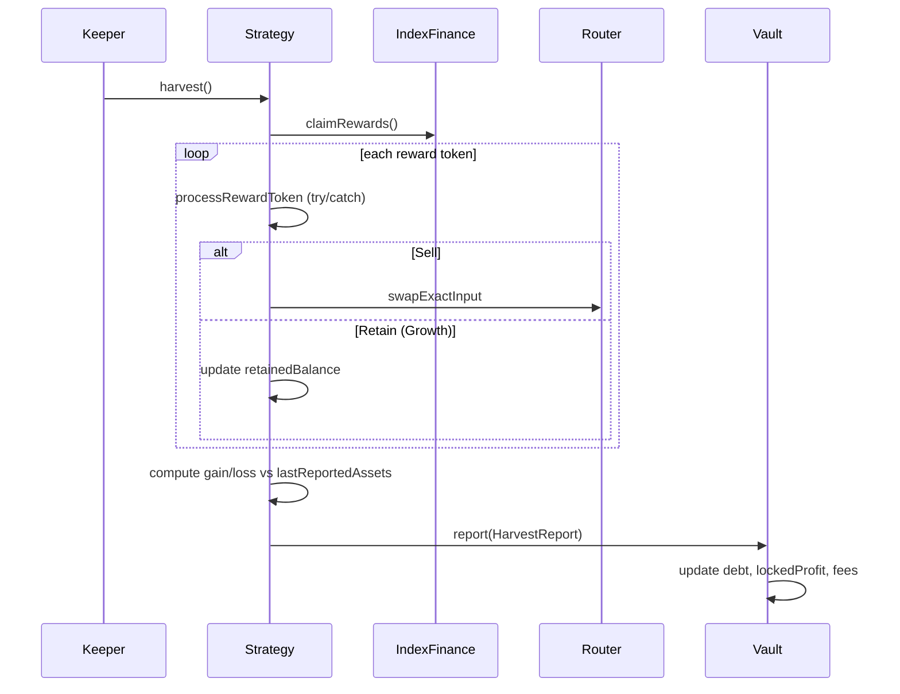

# Chapter 4 — DeFi Fundamentals

DeFi (Decentralized Finance) rebuilds financial primitives as smart contracts. Robin Harvest is a **yield optimizer vault** — this chapter explains every DeFi concept the protocol depends on.

---

## 4.1 Vaults

### What it is

A **vault** pools user deposits, invests according to a strategy, and issues **share tokens** representing pro-rata ownership of the pool's net assets.

### Why it exists

- **Scale**: One professional strategy serves many depositors
- **Gas efficiency**: Batch operations vs individual Index Finance positions
- **UX**: Single ERC-20 share token vs managing many reward tokens

### Robin Harvest

`RobinVault` is an **ERC-4626 vault** with one attached strategy (V1). Two products: **Core** (sell all rewards) and **Growth** (retain stocks + in-kind exit).

---

## 4.2 ERC-4626

### What it is

[EIP-4626](https://eips.ethereum.org/EIPS/eip-4626) standardizes tokenized vaults: `deposit`, `withdraw`, `mint`, `redeem`, previews, `totalAssets`, `convertToShares`.

### Why it exists

Wallets, aggregators, and accounting tools integrate one interface.

### Share math (Robin Harvest — `ERC4626Paris`)

Virtual offset anti-inflation:

```
shares = assets × (totalSupply + 10^offset) / (totalAssets + 1)
assets = shares × (totalAssets + 1) / (totalSupply + 10^offset)
```

`RobinVault` uses **`offset = 6`** (`DECIMALS_OFFSET`).

Robin Harvest **overrides** `totalAssets()` to exclude unlocked profit and include `strategyDebt`.

### Alternatives

Non-4626 vaults (Yearn v1 patterns) — worse composability. Robin Harvest chose 4626 + extensions.

---

## 4.3 Yield Strategies

### What it is

A **strategy** contract that receives vault assets, generates yield, and reports performance.

### Robin Harvest

| Strategy | Behavior |
|---|---|
| `CoreStrategy` | Deploy INDEX to Index Finance; claim rewards; **sell all** to INDEX |
| `GrowthStrategy` | Same + **retain** approved stocks; liquidate on INDEX-only withdraw |

Strategy interface: `IRobinStrategy` — `deployFunds`, `freeFunds`, `harvest`, `tend`, lifecycle, `emergencyWithdraw`.

**One strategy per vault** in V1. Timelocked migration when `strategyDebt == 0`.

---

## 4.4 Auto-Compounding

### What it is

Rewards reinvested into the principal position so returns compound.

### Robin Harvest

`harvest()` claims rewards, sells (or retains) them, transfers INDEX debt payment to vault, calls `vault.report()`. Gains increase `strategyDebt` and **`lockedProfit`**. Keepers call `deployIdle()` to redeploy idle INDEX.

Not automatic on every block — **keeper-triggered**.

---

## 4.5 NAV (Net Asset Value)

### What it is

Total economic value of a fund divided by shares outstanding — here, **`totalAssets()` per share**.

### Robin Harvest formula

```
grossAssets = vaultIdleINDEX + strategyDebt
totalAssets = grossAssets − lockedProfitRemaining
```

Growth strategy NAV (`StrategyBase.totalAssets()`):

```
idleINDEX + deployedInIndexFinance + portfolioValue(retainedStocks)
```

Retained stocks valued conservatively: **min(oracle, DEX quote) − navHaircutBps**.

---

## 4.6 Share Accounting

Depositors receive **`rhINDEX-C`** or **`rhINDEX-G`** shares. Share price rises when `totalAssets` grows faster than supply.

**Debt accounting:** When vault sends INDEX to strategy, **`strategyDebt`** increases — vault books deployed capital without double-counting idle balance.

On withdrawal, `freeFunds` reduces debt by `amountFreed + loss`.

See [09-mathematics.md](./09-mathematics.md) for worked examples.

---

## 4.7 Liquidity Providers (LPs) and DEXs

### What it is

**DEXs** let users swap tokens. **LPs** deposit pairs into pools; earn fees; enable swaps.

### Robin Harvest

Uses **Uniswap V2-style** router via `UniswapV2DexAdapter` — constant-product `x×y=k` pools.

`ExecutionRouter` executes **exact-input swaps** only — no arbitrary calldata.

**LP strategy** for direct LP provision: **not implemented** (README: blocked on LP type confirmation).

---

## 4.8 AMMs, Slippage, Price Impact

### AMM

Automated Market Maker prices trades from pool reserves.

### Slippage

Difference between expected and executed price. Large trades move price (**price impact**).

### Robin Harvest mitigations

1. **Strategy:** `maxSlippageBps` on min output from oracle (`CoreStrategy._minimumOutput`)
2. **Router:** `minAmountOut`, deadline, optional **oracle deviation** check per route
3. **Withdrawals:** User **`maxLossBps`** on strategy `freeFunds` loss
4. **In-kind:** `maxLossBps` on INDEX slippage when freeing deployed capital

Multi-hop paths: `UniswapV2DexAdapter.setCustomPath` for illiquid direct pairs.

---

## 4.9 Harvesting

### What it is

Periodic collection and processing of earned rewards.

### Robin Harvest pipeline



Per-token isolation: failed token → `isRewardTokenIsolated[token] = true`.

---

## 4.10 Management Fees

### What it is

Time-based fee on assets under management (AUM).

### Robin Harvest — `RobinAccountant._accrueManagementFee`

```
managementFee = totalAssetsGross × managementBps / BPS × elapsed / SECONDS_PER_YEAR
```

Accrued on each `assessReportFees` call (during `report()`).

**Cap-and-forfeit:** Total fees capped at current `lockedProfit`; excess **forfeited** (CHANGELOG v1.2).

---

## 4.11 Performance Fees and High-Water Mark

### Performance fee

Charged on **new profits** above historical peak.

### High-water mark (`RobinAccountant`)

- Tracks `highWaterMark` — peak gross assets after performance fee assessment
- Fee on `min(reportedGain, totalAssetsGross − highWaterMark)` when above HWM
- Losses: no performance fee until HWM recovered

After fee: `highWaterMark = totalAssetsGross`.

---

## 4.12 Locked Profit (Profit Smoothing)

### What it is

Mechanism to **exclude recent gains** from `totalAssets()` so share price does not instantly jump after harvest — reduces **harvest sandwich** (deposit right before report, withdraw after).

### Robin Harvest

On `report()`: `lockedProfit += report_.gain`.

Linear unlock over `profitMaxUnlockTime` (default **7 days**):

```
remaining = lockedProfit × (1 − elapsed / duration)
```

`_syncLockedProfit()` ages profit before new reports or duration changes.

**Fees** deducted from `lockedProfit` first (capped).

---

## 4.13 Oracle Pricing

### What it is

On-chain price feeds for assets — Robin Harvest uses **Chainlink-shaped** `IPriceFeed.latestRoundData()`.

### OracleRegistry validation

- Positive answer
- Complete round (`answeredInRound >= roundId`)
- Heartbeat staleness check
- Pause flag
- Decimal normalization to **1e18**
- `uiMultiplier` for corporate actions (display/adjustment)

Used for: swap min output, retained NAV, exposure caps, router deviation checks.

**Risk:** Stale/manipulated feeds → bad swaps or wrong NAV. Mitigated by heartbeat, deviation bounds, conservative min(oracle, quote).

---

## 4.14 Flash Loans

### What it is

Borrow large amounts **within one transaction**, must repay by tx end.

### Relevance

Attackers can temporarily inflate balances or manipulate AMM prices within a single tx.

Robin Harvest: no flash-loan-specific guard; relies on **report-time gain** from strategy NAV delta (not spot balance alone for sustained inflation), oracle + minOut on swaps, and **locked profit** timing. In-kind redemption checks preview vs actual with **maxLossBps**.

Residual risk documented in [12-security.md](./12-security.md).

---

## 4.15 Sandwich Attacks and MEV

### Sandwich

Attacker frontruns victim swap (pushes price), victim executes, attacker backruns.

### Robin Harvest

- Slippage limits on swaps
- Oracle deviation on router
- In-kind: user bears bounded slippage (`maxLossBps`); tests include `testInKindSandwichExploitFails`

### MEV

Validators/ builders reorder txs for profit. Keepers compete on `harvest()` — not user-critical for deposits if locked-profit design holds.

---

## 4.16 Stablecoins

### What it is

Tokens pegged to fiat (USDC, USDT). **INDEX** is the vault asset — not necessarily a stablecoin; handbook treats it as the **unit of account** for the protocol.

Oracle prices convert **stock tokens → INDEX** for NAV and swaps.

---

## 4.17 Why Robin Harvest Needs Each Piece

| DeFi concept | Robin Harvest component |
|---|---|
| ERC-4626 vault | `RobinVault`, `ERC4626Paris` |
| Strategy | `CoreStrategy`, `GrowthStrategy` |
| Harvest | `StrategyBase.harvest()` |
| DEX swap | `ExecutionRouter`, `UniswapV2DexAdapter` |
| Oracle | `OracleRegistry` |
| Reward policy | `RewardRegistry` |
| Fees | `RobinAccountant` |
| Locked profit | `RobinVault.lockedProfit` |
| Exposure limits | `GrowthStrategy._enforceExposure` |

**Next:** [05-project-overview.md](./05-project-overview.md)
