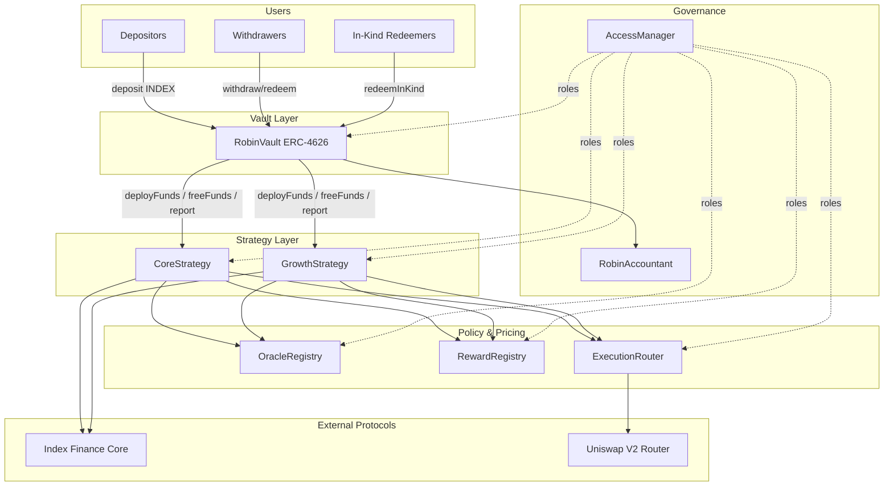

# Chapter 5 — Project Overview

## 5.1 Mission

Robin Harvest is a **Foundry-based smart contract system** that operates **ERC-4626 yield optimizer vaults** on **Robinhood Chain**, targeting **Index Finance (INDEX)** products. It automates capital deployment, reward claiming, reward disposition (sell / retain / ignore), NAV reporting, fee assessment, and user exits — including optional **in-kind redemption** of retained tokenized stocks in the Growth vault.

**Repository:** `robin-harvest-contracts`  
**Version:** `v0.1.0-alpha`  
**License:** MIT  
**Toolchain:** Solidity 0.8.25, Foundry v1.9.7, OpenZeppelin v5.6.1, EVM Paris

---

## 5.2 Problem Statement

Index Finance participants earn **INDEX** exposure plus **reward tokens** (often tokenized equities). Operating this manually imposes:

1. **Operational burden** — claim timing, swaps, eligibility rules
2. **Portfolio construction** — which rewards to hold vs sell
3. **Accounting complexity** — NAV, fees, share price fairness
4. **Liquidity mismatch** — users want INDEX liquidity or direct stock exposure

Robin Harvest pools capital, executes a **governance-defined policy** on-chain, and exposes simple UX: **deposit INDEX → hold vault shares → withdraw INDEX or (Growth) redeem in kind**.

---

## 5.3 Product Lines

### Core (`rhINDEX-C`)

| Aspect | Detail |
|---|---|
| Vault | `RobinVault` — "Robin INDEX Core Vault" |
| Strategy | `CoreStrategy` |
| Rewards | **Sell all** enabled rewards to INDEX via `ExecutionRouter` |
| Retention | **Forbidden** — `RetainedRewardsUnsupported` if disposition is Retain |
| Redemption | Standard ERC-4626 INDEX only |
| Target user | Max INDEX compounding; no stock basket exposure |

### Growth (`rhINDEX-G`)

| Aspect | Detail |
|---|---|
| Vault | `RobinVault` — "Robin INDEX Growth Vault" |
| Strategy | `GrowthStrategy` extends `CoreStrategy` |
| Rewards | **Sell**, **Ignore**, or **Retain** per `RewardRegistry` |
| Portfolio | `retainedBalance`, category policies, exposure caps |
| NAV | Conservative: min(oracle, quote) − `navHaircutBps` |
| Redemption | ERC-4626 INDEX **or** `redeemInKind` (INDEX + retained stocks) |
| Withdrawals | Liquidates retained assets in **`liquidationOrder`** if needed |

### LP (`rhINDEX-LP`)

| Aspect | Detail |
|---|---|
| Vault | `RobinVault` — "Robin INDEX LP Vault" |
| Strategy | `LpStrategy` |
| Rewards | Auto-compounds arbitrary reward tokens via `ExecutionRouter` into pool liquidity |
| Liquidity | Single-sided INDEX deposit automatically split via constant-product math into optimal paired stock ratio |
| Staking | Automated Gauge staking (`IGaugeMock`) |
| Valuation | Mark-to-market total pool value via `OracleRegistry` and reserve pricing |
| Redemption | Standard ERC-4626 INDEX only (unpools LP tokens and converts paired token to INDEX) |

All three product lines share registries, router, and access manager from one deployment.

---

## 5.4 End-to-End Protocol Flow

---

## 5.5 Supported Standards

From README:

| Standard | Usage |
|---|---|
| **ERC-20** | INDEX, shares, rewards |
| **ERC-4626** | Vault deposit/withdraw/redeem |
| **EIP-170** | Contract size compliance (CI `forge build --sizes`) |

---

## 5.6 Explicitly Unsupported Assets

| Type | Reason |
|---|---|
| Fee-on-transfer | `_transferExact` balance delta check reverts `FeeOnTransferDetected` |
| Rebasing | Breaks retained balance accounting |
| ERC-777 / hooks | Reentrancy / callback risk |
| Transfer-tax | Same as fee-on-transfer |

---

## 5.7 Trust Assumptions

From README and contracts:

1. **Governance** configures oracles, routes, reward policy honestly
2. **Approved reward tokens** behave as standard ERC-20
3. **Oracle feeds** reflect fair value within heartbeat policy
4. **DEX adapters** are constrained (no arbitrary calldata)
5. **Index Finance** (`IIndexFinanceCore`) reports truthful `totalDeposited`, `withdraw`, `claimRewards`
6. **Keepers** call `harvest`/`deployIdle` but cannot steal funds (role-limited)
7. **Strategies** are not malicious (governance selects bytecode at deploy)

**Not assumed trustless:** Index Finance eligibility rules, stock token corporate actions beyond `uiMultiplier`, chain liveness.

---

## 5.8 Governance Model (Overview)

`AccessManager` roles:

| Role ID | Name | Typical responsibilities |
|---|---|---|
| 1 | GOVERNANCE_ROLE | Top-level policy |
| 2 | STRATEGY_MANAGER_ROLE | Vault/strategy params, routes |
| 3 | KEEPER_ROLE | `harvest`, `tend`, `deploy` |
| 4 | ORACLE_MANAGER_ROLE | Oracle configs |
| 5 | REWARD_MANAGER_ROLE | Reward token registry |
| 6 | SECURITY_COUNCIL_ROLE | Pause, shutdown, emergency |

`ConfigureRobinHarvest.s.sol` maps function selectors to roles. Production expects **multisig** as governance.

---

## 5.9 Version History Highlights (CHANGELOG)

### v1.2 Pre-Audit (Unreleased)

**Added:**
- Multi-hop routing: `UniswapV2DexAdapter.setCustomPath`
- Retained token skipper in `GrowthStrategy._freeFunds` (skip bad oracle/adapter)
- `maxLossBps` on in-kind redemption

**Changed:**
- Cap-and-forfeit fees in `RobinVault._assessReportFees`
- In-kind INDEX flows through vault to user (accounting integrity)
- DEX adapter: pull tokens, forceApprove, reset approval to 0

**Fixed:**
- `removeRewardToken` clears isolation flag
- In-kind sandwich protections tightened

---

## 5.10 Open Questions (`OPEN_QUESTIONS.md`)

Unresolved external parameters (must cite official sources before production):

| Category | Examples |
|---|---|
| **Network** | Chain ID, RPC, finality, testnet, wrapped native |
| **Index Finance** | Official contracts, `claimRewards`/`isEligible` semantics |
| **Tokenized stocks** | Issuers, transfer restrictions, corporate actions |
| **DEX** | Official router/factory, pool tiers |
| **Oracles** | Feed addresses, heartbeats, market hours |
| **Governance** | Multisig, timelock, upgrade policy |
| **Deployment** | CREATE2 policy, verification |
| **Fees** | Production fee rates and recipients |
| **Testing** | Fork block numbers, CI thresholds |

### Resolved (v1.2)

- **Fee shortfall:** Cap at `lockedProfit`, forfeit excess
- **In-kind slippage:** Exiting user bears cost, bounded by `maxLossBps`
- **DEX architecture:** Multi-hop via governance `setCustomPath`

---

## 5.11 Current Limitations

From README:

- Index Finance integration uses **provisional** `IIndexFinanceCore` ABI
- Production oracle addresses **not finalized**
- DEX routes are **external configuration**
- **LP strategy not implemented**
- **No external audit**
- **Not production approved**

---

## 5.12 Documentation vs Implementation

| Item | Docs | Code | Authoritative |
|---|---|---|---|
| In-kind in Phase 6 | Stub/revert | Full implementation Phase 14+ | Code |
| Eligibility metric | Events say "INDEX balance" | `totalAssets()` vs threshold | Code + DESIGN.md intent |
| Strategy maxLoss param | Architecture sketch | Vault-only enforcement | Code |
| Parameterized harvest | Architecture `harvest(bytes)` | Parameterless `harvest()` | Code |

---

## 5.13 Production Readiness Snapshot

| Area | Status |
|---|---|
| Feature completeness | ✅ |
| Unit/integration/invariant tests | ✅ |
| Slither in CI | ✅ |
| External addresses | ⚠️ Pending |
| External audit | ❌ Pending |
| Production deployment | ❌ Blocked |

See [15-production-readiness.md](./15-production-readiness.md).

---

**Next:** [06-architecture.md](./06-architecture.md)
