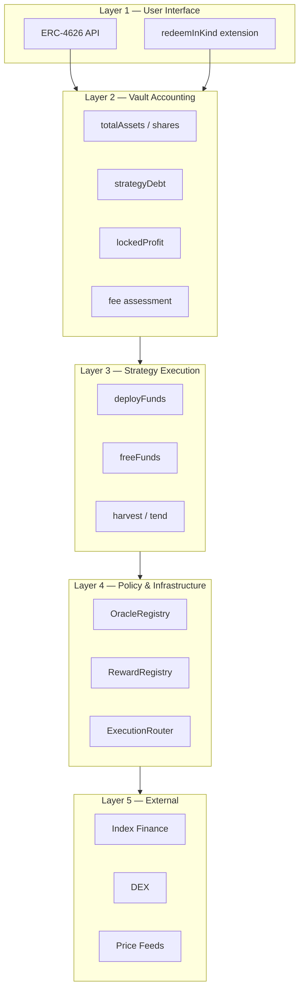
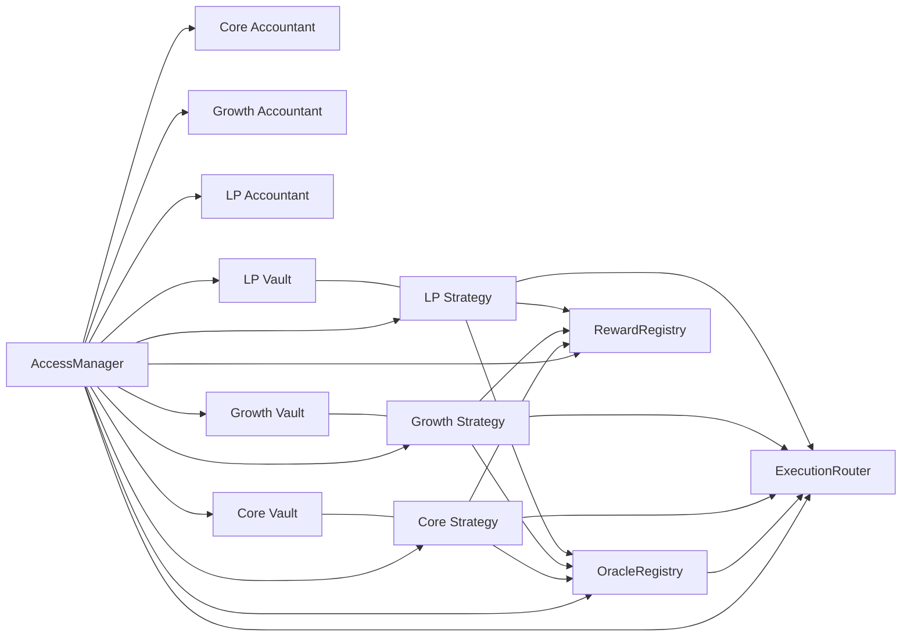
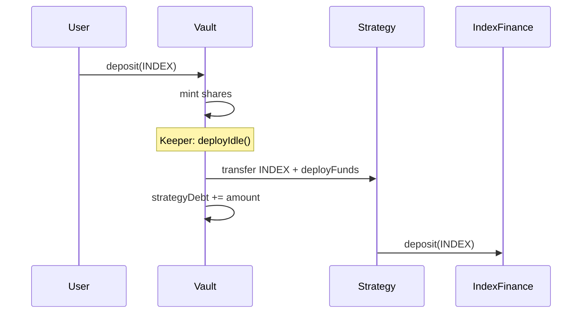

# Chapter 6 — Architecture

## 6.1 Architectural Principles

Robin Harvest V1 architecture follows these design rules (evident in code and DESIGN.md):

1. **One vault ↔ one strategy** — simple debt accounting
2. **Vault is asset-agnostic** — only knows INDEX; strategy owns stock tokens
3. **No arbitrary execution** — router/adapters constrain swaps
4. **Policy in registries** — strategies read oracle/reward config, do not hardcode tokens
5. **Conservative Growth NAV** — min(oracle, executable quote) + haircut
6. **Explicit extensions** — in-kind redemption is separate from ERC-4626
7. **Governance via AccessManager** — delayed roles, selector-level permissions
8. **Fail closed** — stale oracle, unapproved route, exposure cap → revert or skip (withdrawals)

---

## 6.2 System Layers

---

## 6.3 Component Responsibilities

| Component | File | Responsibility |
|---|---|---|
| **RobinVault** | `src/vaults/RobinVault.sol` | ERC-4626 shares, debt, locked profit, deploy, report, in-kind coordination |
| **ERC4626Paris** | `src/vaults/ERC4626Paris.sol` | Paris-compatible ERC-4626 math + virtual shares |
| **StrategyBase** | `src/strategies/StrategyBase.sol` | Abstract lifecycle, harvest loop, vault-only capital |
| **CoreStrategy** | `src/strategies/CoreStrategy.sol` | Index Finance deploy/withdraw/claim/sell |
| **GrowthStrategy** | `src/strategies/GrowthStrategy.sol` | Retention, exposure, liquidation order, in-kind |
| **LpStrategy** | `src/strategies/LpStrategy.sol` | DEX LP provisioning, Gauge staking, optimal swap, auto-compounding |
| **OracleRegistry** | `src/registries/OracleRegistry.sol` | Feed validation, normalization |
| **RewardRegistry** | `src/registries/RewardRegistry.sol` | Token allowlist, disposition, adapters |
| **ExecutionRouter** | `src/router/ExecutionRouter.sol` | Approved adapter/route swaps |
| **UniswapV2DexAdapter** | `src/adapters/UniswapV2DexAdapter.sol` | V2 router integration, custom paths |
| **RobinAccountant** | `src/accounting/RobinAccountant.sol` | Performance + management fees, HWM |
| **AccessManager** | `src/access/AccessManager.sol` | Role hierarchy |

---

## 6.4 Deployment Topology

From `DeployRobinHarvest.s.sol`:

**Shared:** manager, oracle, reward registry, router  
**Per product:** vault, strategy, accountant (Core, Growth, LP)

Post-deploy wiring: `ConfigureRobinHarvest.s.sol` — strategy, accountant, roles, oracles, rewards, routes.

---

## 6.5 Ownership and Trust Boundaries

| Trust boundary | Who controls | Risk if compromised |
|---|---|---|
| AccessManager ADMIN | Governance multisig | Full protocol takeover |
| Oracle feeds | Oracle manager + provider | Wrong NAV, bad swaps |
| Reward registry | Reward manager | Malicious token policy |
| Router routes | Strategy manager | Draining via bad adapter (if adapter malicious) |
| Strategy bytecode | Deployer (immutable) | Logic bugs — audit scope |
| Index Finance | External protocol | Loss of deployed capital |

**Immutable contracts:** No proxy upgrade path in repo — bug fixes require migration (`proposeStrategyMigration` with timelock when debt zero).

---

## 6.6 Lifecycle States

`LifecycleState` enum: **Active**, **Paused**, **Shutdown**

| State | Deposits | Deploy | Harvest | Withdraw |
|---|---|---|---|---|
| Active | ✅ | ✅ | ✅ | ✅ |
| Paused | ❌ | ❌ | ❌ | ✅ (if liquidity) |
| Shutdown | ❌ | ❌ | ❌ | ✅ (if liquidity) |

Shutdown is **irreversible**. `emergencyWithdraw` on strategy shuts down and returns capital.

---

## 6.7 Capital Flow — Steady State

---

## 6.8 Dependency Graph (Imports)

**RobinVault** depends on: ERC4626Paris, AccessManaged, ReentrancyGuard, IRobinStrategy, IRobinAccountant, IInKindRedemptionStrategy, ProtocolTypes, Errors, Events.

**GrowthStrategy** depends on: CoreStrategy → StrategyBase, all registries/router interfaces, IStockToken.

**ExecutionRouter** depends on: IDexAdapter, IOracleRegistry, AccessManaged.

No circular contract dependencies. Vault ↔ Strategy call cycle at runtime only (vault calls strategy; strategy calls `vault.report()`).

---

## 6.9 Key Design Decisions

| Decision | Rationale | Alternative rejected |
|---|---|---|
| ERC4626Paris local base | Paris EVM; OZ ERC4626 uses Cancun | Import OZ ERC4626 (won't compile on Paris) |
| strategyDebt in vault | Single strategy; clear withdraw accounting | Multi-strategy allocator (V2 scope) |
| Locked profit | Anti sandwich on harvest | Instant NAV update (MEV vulnerable) |
| Cap-and-forfeit fees | No fee debt on principal | Accrue fee debt (spiral in downturn) |
| In-kind non-4626 | ERC-4626 assumes single asset out | Break 4626 standard with multi-asset |
| Parameterless harvest | No arbitrary calldata attack surface | Keeper-supplied swap data |
| Try/catch per reward | One bad token doesn't block harvest | All-or-nothing harvest |

---

## 6.10 Execution Flow Index

Detailed sequences in [08-execution-flows.md](./08-execution-flows.md):

- Deposit / Mint
- Withdraw / Redeem (with maxLoss)
- Redeem In Kind
- Harvest + Report + Fees
- Strategy deploy / deployIdle
- LP Deploy (optimal swap → add liquidity → gauge stake)
- LP Withdraw (gauge unstake → remove liquidity → swap paired → INDEX)
- LP Harvest (claim gauge rewards → sell → optimal swap → re-pool → re-stake)
- DEX swap path
- Emergency recovery
- Strategy migration timelock

---

## 6.11 Mathematics Index

Formulas in [09-mathematics.md](./09-mathematics.md):

- Share conversion with offset
- totalAssets / gross / locked
- Performance + management fees
- Retained NAV valuation
- Exposure BPS
- In-kind pro-rata floor rounding
- Optimal single-sided LP swap amount
- Mark-to-market LP token valuation

---

**Next:** [07-repository-walkthrough.md](./07-repository-walkthrough.md)
