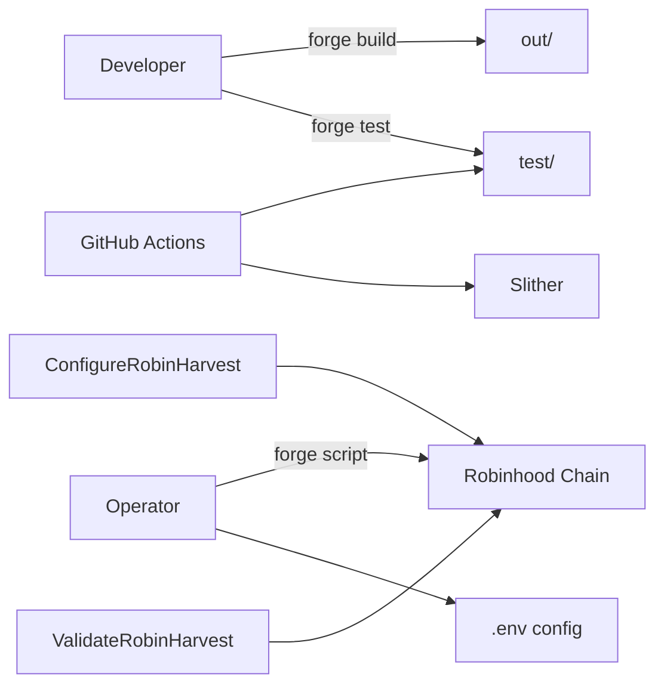

# Chapter 7 — Repository Walkthrough

Every directory and significant file in `robin-harvest-contracts` explained.

---

## 7.1 Root Layout

```
robin-harvest-contracts/
├── src/           # Production Solidity
├── test/          # Foundry tests
├── script/        # Deploy/configure/validate scripts
├── docs/          # Operational docs + this handbook
├── lib/           # Dependencies (forge-std, openzeppelin)
├── .github/       # CI workflows
├── foundry.toml   # Compiler & test config
├── remappings.txt # Import paths
├── slither.config.json
├── .env.example
├── README.md
├── DESIGN.md
├── CHANGELOG.md
└── OPEN_QUESTIONS.md
```

---

## 7.2 `src/` — Production Contracts

### `src/vaults/`

| File | Purpose |
|---|---|
| `RobinVault.sol` | Main ERC-4626 vault: debt, locked profit, fees, in-kind, migration |
| `ERC4626Paris.sol` | Paris-compatible ERC-4626 base with virtual share offset |

### `src/strategies/`

| File | Purpose |
|---|---|
| `StrategyBase.sol` | Abstract strategy framework |
| `CoreStrategy.sol` | Index Finance + sell rewards |
| `GrowthStrategy.sol` | Retention, exposure, in-kind, liquidation |

### `src/registries/`

| File | Purpose |
|---|---|
| `OracleRegistry.sol` | Price feed policy and validation |
| `RewardRegistry.sol` | Reward token allowlist and disposition |

### `src/router/`

| File | Purpose |
|---|---|
| `ExecutionRouter.sol` | Constrained swap execution |

### `src/adapters/`

| File | Purpose |
|---|---|
| `UniswapV2DexAdapter.sol` | Uniswap V2-style router adapter |

### `src/accounting/`

| File | Purpose |
|---|---|
| `RobinAccountant.sol` | Performance + management fee math |

### `src/access/`

| File | Purpose |
|---|---|
| `AccessManager.sol` | OpenZeppelin AccessManager with Robin roles |

### `src/interfaces/`

| File | Purpose |
|---|---|
| `IRobinStrategy.sol` | Strategy API |
| `IRobinVaultReport.sol` | `report()` surface |
| `IRobinAccountant.sol` | Fee assessment API |
| `IOracleRegistry.sol` | Oracle reads |
| `IRewardRegistry.sol` | Reward config reads |
| `IExecutionRouter.sol` | Swap API |
| `IDexAdapter.sol` | Adapter boundary |
| `IInKindRedemptionStrategy.sol` | In-kind preview/redeem |

### `src/interfaces/external/`

| File | Purpose |
|---|---|
| `IIndexFinanceCore.sol` | **Provisional** Index Finance boundary |
| `IPriceFeed.sol` | Chainlink-shaped feed |
| `IUniswapV2Router.sol` | DEX router |
| `IStockToken.sol` | Tokenized stock metadata hooks |
| `IIndexFinance.sol` | Additional Index types if referenced |

### `src/libraries/`

| File | Purpose |
|---|---|
| `Constants.sol` | BPS, SECONDS_PER_YEAR |
| `Errors.sol` | Custom errors |
| `Events.sol` | Shared events (abstract) |

### `src/types/`

| File | Purpose |
|---|---|
| `ProtocolTypes.sol` | Enums and structs |

---

## 7.3 `test/` — Test Suite

### `test/unit/`

| File | Tests |
|---|---|
| `RobinVault.t.sol` | Deposits, caps, pause, deploy, withdraw maxLoss, locked profit, in-kind reverts, fees capped, migration |
| `CoreStrategy.t.sol` | Deploy, free, harvest, sell, isolation, eligibility |
| `GrowthStrategy.t.sol` | Retention, exposure, in-kind suite, liquidation order, sandwich |
| `StrategyBase.t.sol` | onlyVault, isolation, emergency |
| `OracleRegistry.t.sol` | Normalization, stale, paused |
| `RewardRegistry.t.sol` | Disposition validation |
| `ExecutionRouter.t.sol` | Routes, deviation, deadlines |
| `UniswapV2DexAdapter.t.sol` | Direct + multi-hop paths |
| `RobinAccountant.t.sol` | HWM, fuzz fees |
| `AccessManager.t.sol` | Roles |
| `DeploymentFlow.t.sol` | Deploy/configure/validate scripts |

### `test/invariant/`

| File | Purpose |
|---|---|
| `RobinHarvestInvariant.t.sol` | Stateful fuzz: sandwich, NAV, exposure, core retains nothing |

### `test/mocks/`

| Mock | Simulates |
|---|---|
| `MockINDEX.sol` | INDEX token |
| `MockIndexFinanceCore.sol` | Deposit/withdraw/claim |
| `MockDex.sol` | Swaps |
| `MockOracle.sol` | Price feed |
| `MockStockToken.sol` | Stock with transfersEnabled |
| `MockFeeOnTransferToken.sol` | Unsupported token behavior |
| Others | INDEX distributor, etc. |

### `test/helpers/`

| File | Purpose |
|---|---|
| `TestStrategy.sol` | Concrete StrategyBase for unit tests |

---

## 7.4 `script/` — Foundry Scripts

| Script | Purpose |
|---|---|
| `DeployRobinHarvest.s.sol` | Deploy full stack; logs addresses |
| `ConfigureRobinHarvest.s.sol` | Idempotent governance init: roles, wiring, oracles, rewards, routes |
| `ValidateRobinHarvest.s.sol` | Read-only validation against env manifest |

Run with: `forge script script/DeployRobinHarvest.s.sol --rpc-url ... --broadcast`

---

## 7.5 `docs/`

| File | Purpose |
|---|---|
| `DEPLOYMENT.md` | Launch procedures |
| `PHASE_6_10_FUNCTION_REVIEW.md` | Function-by-function review (partially superseded for in-kind) |
| `handbook/` | This technical handbook |

---

## 7.6 `lib/` — Dependencies

Managed by `forge install`:

- **forge-std** v1.9.7 — Test utilities, Script, Vm
- **openzeppelin-contracts** v5.6.1 — AccessManaged, ERC20, SafeERC20, Math, ReentrancyGuard

`.gitmodules` tracks submodule commits.

---

## 7.7 Configuration Files

### `foundry.toml`

```toml
solc_version = "0.8.25"
evm_version = "paris"
optimizer = true
via_ir = true
fuzz.runs = 256 (1000 in ci profile)
invariant.runs = 256 (500 in ci)
fs_permissions = read ./deployments
```

### `remappings.txt`

Maps `@openzeppelin/` → `lib/openzeppelin-contracts/`

### `slither.config.json`

Slither static analysis filters for project.

### `.env.example`

RPC, explorer keys, deployment addresses template — **no secrets in repo**.

---

## 7.8 `.github/workflows/`

| Workflow | Trigger | Action |
|---|---|---|
| `test.yml` | push, PR | `forge build --sizes`, `forge test -vvv` (ci profile) |
| `fmt.yml` | push, PR | `forge fmt --check` |
| `slither.yml` | push, PR | `slither . --fail-pedantic` |

---

## 7.9 Build Artifacts

| Path | Contents |
|---|---|
| `out/` | Compiled JSON (ABI, bytecode) — gitignored typically |
| `cache/` | Foundry cache |
| `deployments/` | Optional archived addresses (fs read permission) |

---

## 7.10 How It Fits Together



---

## 7.11 Reading Order for Source Code

1. `ProtocolTypes.sol` — data model
2. `Errors.sol`, `Events.sol`
3. `ERC4626Paris.sol` → `RobinVault.sol`
4. `StrategyBase.sol` → `CoreStrategy.sol` → `GrowthStrategy.sol`
5. Registries → Router → Adapter
6. `RobinAccountant.sol`, `AccessManager.sol`
7. Scripts and tests for behavior confirmation

---

**Next:** [08-execution-flows.md](./08-execution-flows.md) | Contracts: [08-contracts/README.md](./08-contracts/README.md)
