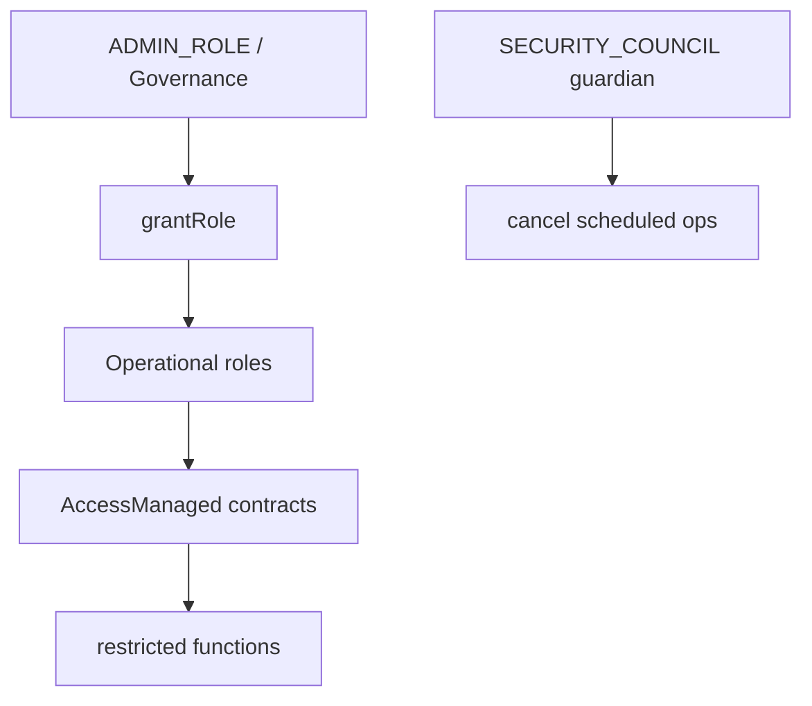

# Contract Reference — RobinAccountant & AccessManager

---

## RobinAccountant (`src/accounting/RobinAccountant.sol`)

### Purpose

Computes **performance fees** (high-water mark) and **time-accrual management fees** when the vault processes a strategy `report()`. Does **not** transfer tokens itself — returns fee amounts; vault applies **cap-and-forfeit** against `lockedProfit` and transfers INDEX to `feeRecipient`.

### Inheritance

`AccessManaged` only

### Immutables

| Name | Type |
|---|---|
| `asset` | IERC20 — INDEX |

### Storage

| Variable | Purpose |
|---|---|
| `vault` | Authorized caller for `assessReportFees` |
| `feeRecipient` | Fee payment destination |
| `feeConfig` | `performanceBps`, `managementBps` |
| `highWaterMark` | Peak gross assets before performance fee |
| `lastFeeAccrual` | Management fee time anchor |

---

### External Functions

#### `setVault(address vault_)` — `restricted`

Links accountant to one vault. Idempotent configuration in `ConfigureRobinHarvest`.

#### `setFeeRecipient(address recipient)` — `restricted`

Must be nonzero.

#### `setFeeConfig(FeeConfig config)` — `restricted`

Validates BPS ≤ 10_000.

#### `assessReportFees(uint256 totalAssetsGross, uint256 reportedGain)` → `(performanceFee, managementFee)`

**Access:** `msg.sender == vault` only (`OnlyVault`).

**Called from:** `RobinVault.report()` → `_assessReportFees`

**Parameters:**

- `totalAssetsGross` — `vault INDEX balance + strategyDebt` **before** fee transfer; includes locked profit in gross assets
- `reportedGain` — strategy report gain component

**Performance fee logic** (`_assessPerformanceFee`):

1. If `reportedGain == 0` or `performanceBps == 0` → 0
2. Initialize HWM on first fee event: if `highWaterMark == 0` and `totalAssetsGross > reportedGain`, set HWM to pre-gain level
3. If `totalAssetsGross <= highWaterMark` → 0 (still recovering losses)
4. `feeableGain = min(totalAssetsGross - HWM, reportedGain)`
5. `performanceFee = feeableGain * performanceBps / BPS`
6. Update `highWaterMark = totalAssetsGross`

**Management fee logic** (`_accrueManagementFee`):

$$\text{managementFee} = \text{totalAssetsGross} \times \frac{\text{managementBps}}{\text{BPS}} \times \frac{\text{elapsed}}{\text{SECONDS\_PER\_YEAR}}$$

Updates `lastFeeAccrual = block.timestamp` each call.

**Events:** `PerformanceFeeAssessed`, `ManagementFeeAssessed`, `FeeConfigUpdated`

---

### Vault Integration — Cap-and-Forfeit

In `RobinVault._assessReportFees`:

```solidity
totalFee = performanceFee + managementFee;
if (totalFee > lockedProfit) {
    emit FeesCapped(totalFee, lockedProfit);
    totalFee = lockedProfit;
}
lockedProfit -= totalFee;
_ensureLiquidity(totalFee, MAX_BPS);
safeTransfer(feeRecipient, totalFee);
```

**Implication:** Fees cannot exceed currently **vested-unlocked** locked profit pool at report time (after `_syncLockedProfit`). Excess is **forfeited**, not deferred as debt.

---

### Security Considerations

- Only vault may trigger assessment — prevents third-party HWM manipulation
- HWM uses **gross** assets including locked profit — aligns fee base with economic AUM
- Management fee linear in time — predictable; resets accrual clock on each report
- **Trust:** vault must pass honest `totalAssetsGross` and `reportedGain` — derived from strategy report path

### Tests

`test/unit/RobinAccountant.t.sol` — HWM, loss recovery, fuzz fee math

---

## AccessManager (`src/access/AccessManager.sol`)

### Purpose

Thin wrapper around OpenZeppelin **AccessManager** defining Robin Harvest **role IDs** and default **admin/guardian** relationships. All protocol contracts use `AccessManaged(authority)` pointing at this manager.

### Inheritance

`OpenZeppelinAccessManager`

### Constants — Role IDs

| Constant | ID | Typical holder |
|---|---|---|
| `GOVERNANCE_ROLE` | 1 | Multisig |
| `STRATEGY_MANAGER_ROLE` | 2 | Ops / product |
| `KEEPER_ROLE` | 3 | Automation bot |
| `ORACLE_MANAGER_ROLE` | 4 | Oracle ops |
| `REWARD_MANAGER_ROLE` | 5 | Token list curator |
| `SECURITY_COUNCIL_ROLE` | 6 | Emergency multisig |

OpenZeppelin `ADMIN_ROLE` (0) held by initial governance at deploy.

---

### Constructor

```solidity
constructor(address initialGovernance) OpenZeppelinAccessManager(initialGovernance)
```

- Configures operational roles: admin = `GOVERNANCE_ROLE`, guardian = `SECURITY_COUNCIL_ROLE`
- `GOVERNANCE_ROLE` admin = `ADMIN_ROLE`, guardian = `SECURITY_COUNCIL_ROLE`
- `SECURITY_COUNCIL_ROLE` admin = `GOVERNANCE_ROLE`, self-guardian

**Note:** Selector-to-role mappings are **not** in constructor — applied in `ConfigureRobinHarvest.s.sol` post-deploy.

---

### Selector Role Matrix (from ConfigureRobinHarvest)

#### RobinVault

| Role | Functions |
|---|---|
| STRATEGY_MANAGER | setStrategy, migration, accountant, caps, buffers, max loss, profit unlock, eligibility |
| KEEPER | deploy, deployIdle |
| SECURITY_COUNCIL | pause, unpause, shutdown, minPostWithdrawAssets |

#### StrategyBase / CoreStrategy

| Role | Functions |
|---|---|
| STRATEGY_MANAGER | setCoreParameters (Core) |
| KEEPER | harvest, tend |
| REWARD_MANAGER | add/remove reward token, isolation |
| SECURITY_COUNCIL | pause, unpause, shutdown, emergencyWithdraw |

#### GrowthStrategy (additional)

| Role | Functions |
|---|---|
| STRATEGY_MANAGER | setCategoryPolicy, setLiquidationOrder, setNavHaircutBps, markRebalance |

#### Registries & Router

| Role | Functions |
|---|---|
| ORACLE_MANAGER | OracleRegistry setters |
| REWARD_MANAGER | RewardRegistry setters |
| STRATEGY_MANAGER | ExecutionRouter adapter/route |

---

### Security Model



**Trust assumptions:**

- Compromised governance can misconfigure oracles, routes, and fee recipient
- Security Council can pause but not unilaterally steal funds without misconfigured external calls
- Keepers can harvest and deploy — cannot change policy
- **No on-chain timelock in AccessManager wrapper** — delays depend on OZ AccessManager scheduling config at governance discretion

### Tests

`test/unit/AccessManager.t.sol` — role IDs, admin, unauthorized grant

### Validation

`ValidateRobinHarvest.s.sol` verifies roles, authorities, and `canCall` for critical selectors.

---

**Next:** [interfaces-types-libraries.md](./interfaces-types-libraries.md)
