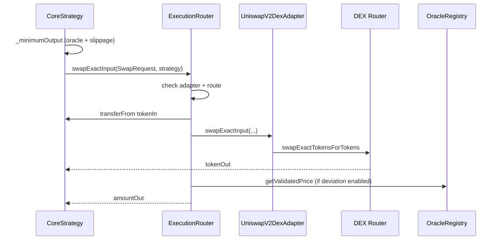

# Contract Reference — ExecutionRouter & UniswapV2DexAdapter

---

## ExecutionRouter (`src/router/ExecutionRouter.sol`)

### Purpose

**Constrained swap executor** for the protocol. Strategies never call DEX routers directly. All swaps flow through governance-approved **adapters** and **routes**, with optional **oracle deviation** checks, **deadlines**, **min output**, **balance-delta verification**, and **reentrancy protection**.

**Architecture role:** Security boundary between strategy logic and external DEX liquidity. No arbitrary `target` + `calldata` execution is exposed.

### Inheritance

`IExecutionRouter`, `AccessManaged`, `ReentrancyGuard`, `Events`

### Immutables

| Name | Type | Purpose |
|---|---|---|
| `oracleRegistry` | IOracleRegistry | Price validation for deviation checks |

### Internal Types

```solidity
struct RouteConfig {
    bool enabled;
    uint16 maxOracleDeviationBps;
}
```

### Storage

| Mapping | Purpose |
|---|---|
| `_approvedAdapters[adapter]` | Global adapter allowlist |
| `_routes[routeId]` | Per (adapter, tokenIn, tokenOut) policy |

`routeId = keccak256(abi.encode(adapter, tokenIn, tokenOut))` — see `getRouteId`.

---

### External Functions

#### `swapExactInput(SwapRequest request, address recipient)` → `uint256 amountOut`

**Purpose:** Execute one exact-input swap.

**Access:** Any caller (typically a strategy). Route and adapter must be pre-approved.

**Parameters:**

| Field | Meaning |
|---|---|
| `request.adapter` | `IDexAdapter` implementation |
| `request.tokenIn` / `tokenOut` | Pair |
| `request.amountIn` | Exact sell amount |
| `request.minAmountOut` | Slippage floor |
| `request.deadline` | Unix timestamp; reverts if `block.timestamp > deadline` |

**Execution steps:**

1. Validate recipient, amount, deadline, adapter approval, route enabled.
2. Snapshot `tokenOut` balance of `recipient`.
3. `safeTransferFrom` `tokenIn` from `msg.sender` (strategy) to router.
4. `forceApprove` adapter; call `IDexAdapter.swapExactInput(...)`.
5. Reset approval to 0.
6. Compare balance delta vs `minAmountOut`.
7. If `maxOracleDeviationBps > 0`, `_enforceOracleDeviation`.
8. Emit `SwapExecuted`.

**Events:** `SwapExecuted`

**Errors:** `ZeroAddress`, `ZeroAmount`, `DeadlineExpired`, `NotApproved`, `RouteNotApproved`, `InsufficientOutput`, `OracleDeviationExceeded`

**Security:**

- **ReentrancyGuard** on entry
- **Balance-delta** accounting catches fee-on-transfer misreporting at recipient
- **Oracle deviation** optional per route (`0` disables)
- **No arbitrary calls** — only approved adapter interface

**Callers:** `CoreStrategy._sellReward`, `GrowthStrategy._sellReward`, liquidation in `_freeFunds`

**Gas:** Two token transfers + adapter swap + optional two oracle reads

---

#### `isAdapterApproved(address adapter)` → `bool`

View adapter allowlist status.

#### `isRouteApproved(adapter, tokenIn, tokenOut)` → `bool`

View route `enabled` flag.

#### `getRouteConfig(...)` → `RouteConfig`

Returns enabled + maxOracleDeviationBps.

#### `setAdapterApproval(address adapter, bool approved)` — `restricted`

Governance adds/removes adapters. **Role:** Strategy Manager (via `ConfigureRobinHarvest`).

#### `setRoute(adapter, tokenIn, tokenOut, enabled, maxOracleDeviationBps)` — `restricted`

Registers or updates a route. Validates nonzero addresses and BPS ≤ 10_000.

#### `getRouteId(adapter, tokenIn, tokenOut)` → `bytes32` — `pure`

Deterministic route key.

---

### Private: `_enforceOracleDeviation`

Computes expected output from oracle prices (same formula as strategy min output):

$$\text{expectedOut} = \text{amountIn} \times \frac{P_{in}}{P_{out}} \times \frac{10^{d_{out}}}{10^{d_{in}}}$$

Compares actual vs expected; reverts if deviation BPS exceeds route limit.

**Note:** Setting `maxOracleDeviationBps = 0` **intentionally disables** this check for that route.

---

## UniswapV2DexAdapter (`src/adapters/UniswapV2DexAdapter.sol`)

### Purpose

**Venue-specific** implementation of `IDexAdapter` for a constant-product **Uniswap V2-style router**. Encodes path selection (direct pair or governance-configured multi-hop).

### Inheritance

`IDexAdapter`, `AccessManaged`

### Immutables

| Name | Type |
|---|---|
| `router` | IUniswapV2Router |

### Storage

`_customPaths[tokenIn][tokenOut]` → `address[]` multi-hop path

---

### External Functions

#### `setCustomPath(tokenIn, tokenOut, path[])` — `restricted`

**Purpose:** Configure safe multi-hop routing when direct pair liquidity is thin (CHANGELOG v1.2).

**Validation:**

- `path.length >= 2`
- `path[0] == tokenIn`, `path[last] == tokenOut`
- No zero addresses in path

**Security:** Only governance (`AccessManaged`) can set paths — mitigates malicious route injection.

---

#### `swapExactInput(tokenIn, tokenOut, amountIn, minAmountOut, recipient, deadline)` → `amountOut`

**Purpose:** Pull tokens, approve router, swap, verify balance delta.

**Steps:**

1. `safeTransferFrom` from `msg.sender` (ExecutionRouter) to adapter
2. `forceApprove(router, amountIn)`
3. `router.swapExactTokensForTokens(..., path, recipient, deadline)`
4. Approve router to **0**
5. `amountOut = balanceAfter − balanceBefore` on recipient
6. Revert if `amountOut < minAmountOut`

**Security:**

- Approval reset post-swap (CHANGELOG hardening)
- Balance-delta vs router return value
- Deadline check

**Callers:** Only `ExecutionRouter` in production wiring (adapter receives tokens from router)

---

#### `quoteExactInput(tokenIn, tokenOut, amountIn)` → `amountOut` — `view`

Calls `router.getAmountsOut`. Returns **0** on failure (try/catch).

**Used by:** `GrowthStrategy._quoteValue` for conservative NAV (min of oracle and executable quote).

---

### Private: `_path(tokenIn, tokenOut)`

Returns custom path if set; else `[tokenIn, tokenOut]` direct pair.

---

## Interaction Diagram



---

## Design Decisions

| Decision | Rationale |
|---|---|
| Router holds funds briefly | Centralized approval scoping; adapter resets allowances |
| Route = adapter + pair | No calldata injection surface |
| Separate RewardRegistry adapter approval | Policy per token vs router global adapter list |
| Multi-hop via governance path | Liquidity flexibility without arbitrary execution |

---

## Failure Cases

| Scenario | Behavior |
|---|---|
| Unapproved adapter | `NotApproved` |
| Disabled route | `RouteNotApproved` |
| Expired deadline | `DeadlineExpired` |
| Low DEX output | `InsufficientOutput` |
| Oracle vs execution mismatch | `OracleDeviationExceeded` |
| Invalid custom path | `InvalidPath` |

---

## Tests

- `test/unit/ExecutionRouter.t.sol` — swap, deadline, route, deviation
- `test/unit/UniswapV2DexAdapter.t.sol` — direct pair, multi-hop, fee-on-transfer

---

**Next:** [accounting-and-access.md](./accounting-and-access.md)
