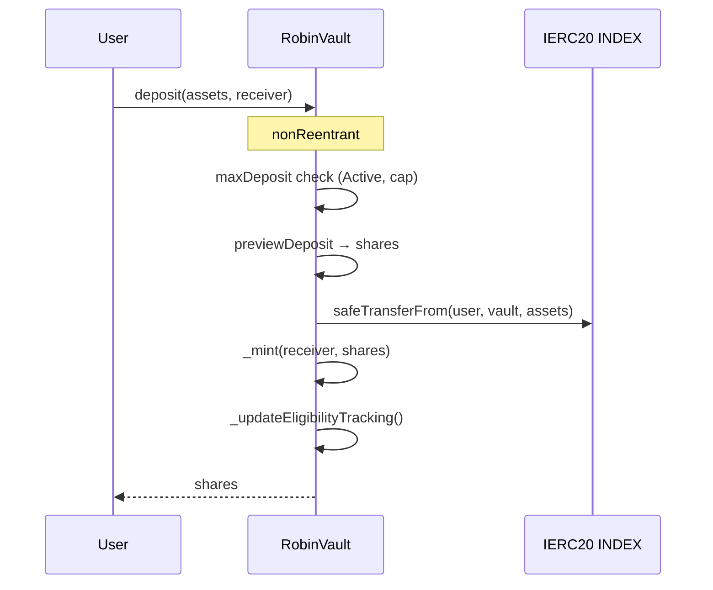
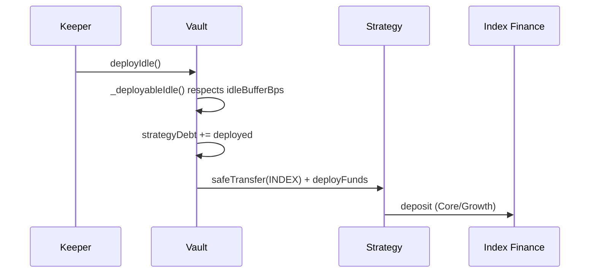
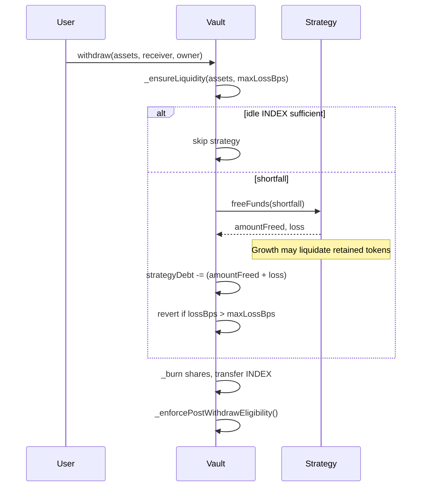
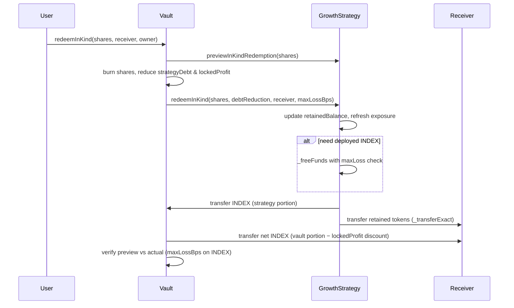
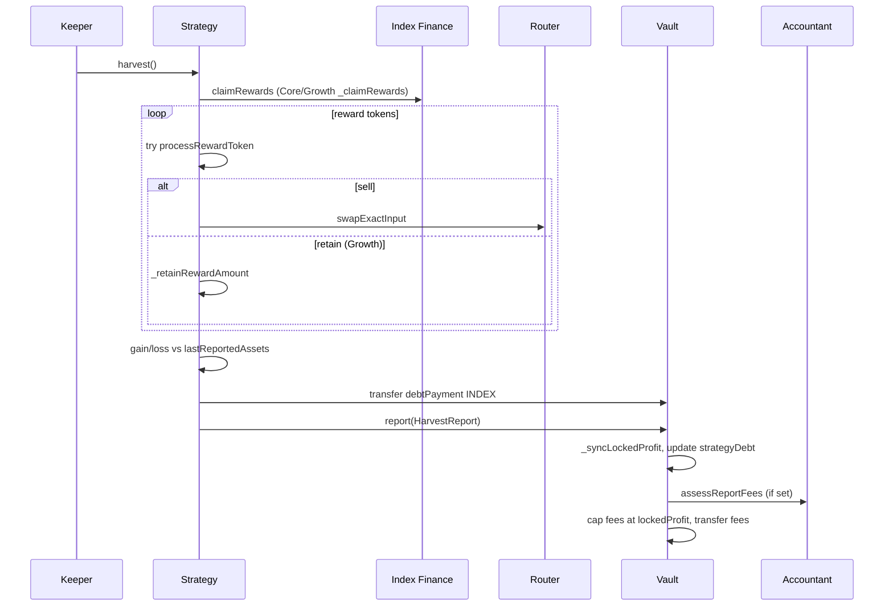
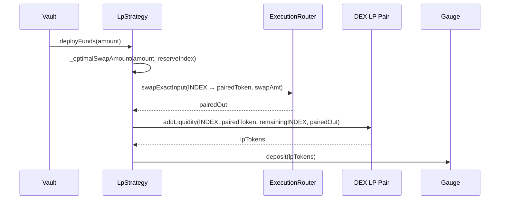
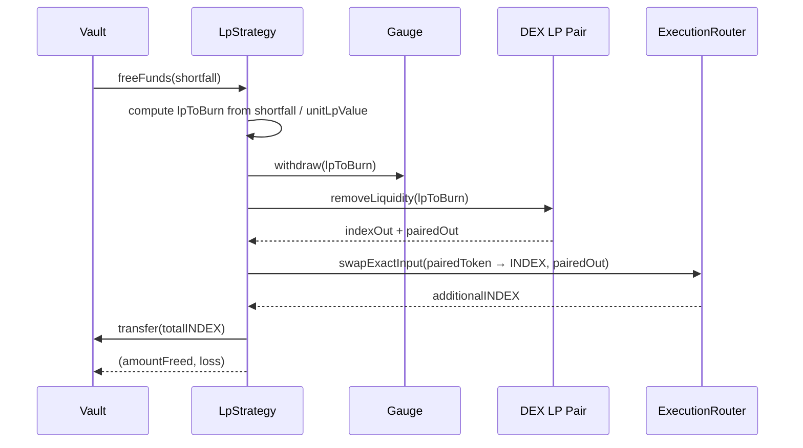
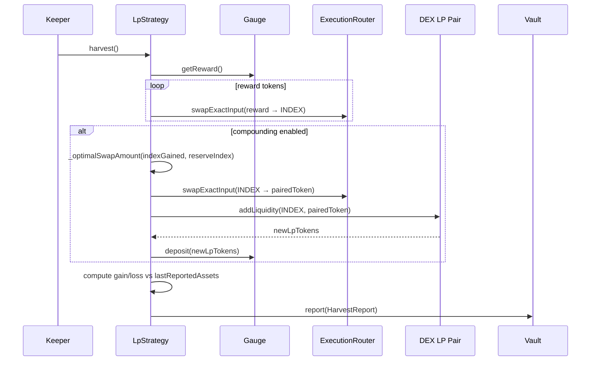

# Chapter 8 — Execution Flows

Every major transaction path in Robin Harvest, with contract interactions and state changes.

---

## 8.1 Deposit

**Entry:** `RobinVault.deposit(assets, receiver)` or `mint(shares, receiver)`

**State changes:**
- User INDEX ↓; vault idle INDEX ↑
- `totalSupply` ↑
- `totalAssets()` ↑ (no strategyDebt change yet)
- Eligibility event if threshold crossed

**Access:** Public when Active and under `depositCap`.

**Contract:** `RobinVault.deposit` → `ERC4626Paris._deposit`

---

## 8.2 Deploy Idle / Deploy

**Entry:** `deployIdle()` (keeper) or `deploy(assets)` (keeper)

**State:** `strategyDebt` ↑; vault idle ↓; strategy deployed position ↑

**Functions:** `RobinVault._deployToStrategy`, `CoreStrategy._deployFunds`

---

## 8.3 Standard Withdraw / Redeem

**Entry:** `withdraw(assets, receiver, owner)` or overload with `maxLossBps`

**Growth `_freeFunds` extension:** After `super._freeFunds`, loops `liquidationOrder` / `_retainedTokens`, sells retained assets via `_sellReward` until INDEX available or tokens exhausted. Skips tokens without oracle/adapter.

**Contracts:** `RobinVault._withdrawWithMaxLoss`, `_ensureLiquidity`, `StrategyBase.freeFunds`, `GrowthStrategy._freeFunds`

---

## 8.4 Redeem In Kind (Growth Only)

**Entry:** `redeemInKind(shares, receiver, owner[, maxLossBps])`

Full CEI documented in `DESIGN.md`. Implementation in `RobinVault._redeemInKindWithMaxLoss` + `GrowthStrategy.redeemInKind`.

**Invariants (tested):**
- NAV conservation ± floor dust
- Debt reduction ∝ shares burned
- preview = event = balance delta for retained tokens

**Unsupported:** Non-Growth strategy → `InKindRedemptionNotSupported`

---

## 8.5 Harvest and Report

**Entry:** `StrategyBase.harvest()` (keeper, restricted)

**Key functions:**
- `StrategyBase.harvest` — lines 87–124
- `CoreStrategy._processRewardToken` / `GrowthStrategy._processRewardToken`
- `RobinVault.report` — lines 419–440
- `RobinVault._assessReportFees` — cap-and-forfeit

---

## 8.6 Fee Accounting Flow

Triggered inside `report()` when `accountant` is set:

1. `_syncLockedProfit()`
2. Update `strategyDebt` from gain/loss/debtPayment
3. Add `report_.gain` to `lockedProfit`
4. `accountant.assessReportFees(grossAssets, reportedGain)`
5. If `totalFee > lockedProfit` → emit `FeesCapped`, fee = lockedProfit
6. `lockedProfit -= totalFee`
7. `_ensureLiquidity(totalFee, MAX_BPS)` — free strategy funds if needed
8. Transfer INDEX to `feeRecipient`

**Performance fee:** Only on gains above HWM (`RobinAccountant._assessPerformanceFee`)

**Management fee:** Time-proportional on gross assets

---

## 8.7 DEX Swap Flow

**Entry:** `ExecutionRouter.swapExactInput(SwapRequest, recipient)`

Caller: typically `CoreStrategy._sellReward`

1. Validate adapter approved, route enabled, deadline
2. Pull `tokenIn` from msg.sender (strategy)
3. Approve adapter
4. `IDexAdapter.swapExactInput(...)`
5. Reset approval
6. Verify balance delta ≥ minAmountOut
7. `_enforceOracleDeviation` if route.maxOracleDeviationBps > 0

**Adapter:** `UniswapV2DexAdapter` pulls from router msg.sender (router), uses direct or custom path.

---

## 8.8 Oracle Read Flow

**Entry:** `OracleRegistry.getValidatedPrice(asset)`

1. Load config; revert if no feed or paused
2. `latestRoundData()` — validate answer, round completeness, heartbeat
3. Normalize to 1e18 × uiMultiplier

**Consumers:** Strategy min output, Growth NAV, router deviation, exposure refresh after in-kind

---

## 8.9 Governance Actions

Examples (all `restricted` + selector roles from Configure script):

| Action | Contract | Function |
|---|---|---|
| Set oracle | OracleRegistry | `setOracleConfig` |
| Enable reward | RewardRegistry | `setRewardTokenConfig` |
| Approve route | ExecutionRouter | `setRoute` |
| Set fees | RobinAccountant | `setFeeConfig` |
| Pause vault | RobinVault | `pause` |
| Set category policy | GrowthStrategy | `setCategoryPolicy` |

AccessManager may require delayed operations for sensitive selectors (configured off-repo in production).

---

## 8.10 Emergency Recovery

**Entry:** `StrategyBase.emergencyWithdraw()` (security council)

1. `_emergencyWithdraw()` — strategy pulls max from Index Finance
2. Transfer all idle INDEX to vault
3. `vault.report({loss, debtPayment})`
4. Set lifecycle **Shutdown**

Vault remains withdrawable if liquidity exists. Users use standard `withdraw`/`redeem`.

---

## 8.11 Strategy Migration

When `strategyDebt == 0`:

1. `proposeStrategyMigration(newStrategy)` — sets `pendingMigration.executableAt`
2. After delay: `executeStrategyMigration()` — replaces `strategy`
3. Or `cancelStrategyMigration()`

Cannot migrate while debt non-zero (`StrategyAlreadySet` / debt checks).

---

## 8.12 Tend (Maintenance)

**Entry:** `StrategyBase.tend()` — no report; updates `lastReportedAssets`

`CoreStrategy._tend`: checks Index Finance eligibility only.

---

**Next:** [09-mathematics.md](./09-mathematics.md)

---

## 8.13 LP Deploy (LpStrategy)

**Entry:** `LpStrategy._deployFunds(amount)` — called by vault via `deployFunds`

**State:** vault idle ↓; strategyDebt ↑; LP tokens staked in Gauge ↑

**Key:** `_optimalSwapAmount` ensures no leftover tokens by solving the constant-product formula.

---

## 8.14 LP Withdraw (LpStrategy)

**Entry:** `LpStrategy._freeFunds(amount)` — called during vault `withdraw`/`redeem`

**Loss:** If `amountFreed < shortfall`, the delta is reported as loss, bounded by `maxLossBps`.

---

## 8.15 LP Harvest (LpStrategy)

**Entry:** `LpStrategy.harvest()` — keeper, restricted

**State:** Reward tokens sold → INDEX → re-pooled → re-staked. Share price increases via `lockedProfit`.

