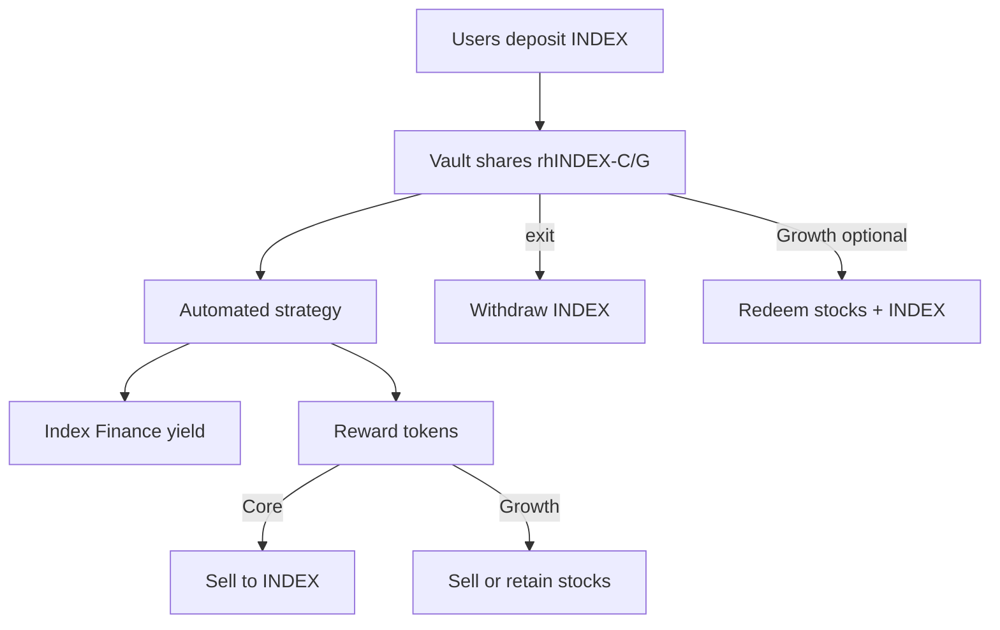

# Chapter 14 — Founder Guide

## 14.1 Elevator Pitch

Robin Harvest turns **Index Finance participation** into a **one-click pooled product**: users deposit **INDEX**, receive **vault shares**, and a professional on-chain strategy handles deployment, reward claiming, and policy-driven selling or **stock retention** (Growth). Users exit to **INDEX** or, in Growth, optionally take **proportional tokenized stocks** without forced liquidation.

---

## 14.2 What Problem It Solves

| Pain | Robin Harvest answer |
|---|---|
| Manual reward claiming | Keeper `harvest()` |
| When to sell vs hold stocks | Governance `RewardRegistry` + Growth category policy |
| Fair share of pooled performance | ERC-4626 NAV accounting |
| Tax/UX preference for stock exposure | `redeemInKind` (Growth) |
| Risk of naive swap routing | Constrained `ExecutionRouter` + oracle checks |

---

## 14.3 Why This Architecture

**One vault, one strategy (V1):** Minimizes accounting bugs; clear `strategyDebt`. Multi-strategy allocators add complexity — deferred.

**Separate Core and Growth products:** Different risk/UX profiles without forcing one policy on all users.

**Registries off-strategy:** Token lists and oracles change frequently; upgrading policy shouldn't redeploy strategy logic.

**Locked profit:** Protects existing depositors from harvest sandwiching — industry pattern (Yearn-style).

**Cap-and-forfeit fees:** Protocol never extracts fees by impairing principal when gains aren't locked yet — user trust during drawdowns.

---

## 14.4 Business Value

- **AUM aggregation** on Robinhood Chain around INDEX ecosystem
- **Differentiated Growth product** — stock basket exposure + in-kind exit
- **Fee revenue** via performance + management fees (`RobinAccountant`)
- **Composable ERC-4626 shares** for integrations and frontends

---

## 14.5 Technical Tradeoffs (Founder-Friendly)

| Choice | Upside | Downside |
|---|---|---|
| Immutable contracts | Trust / predictability | Bug fix = migrate vault |
| Conservative Growth NAV | Safer share price | Understates true market value |
| No arbitrary swap calldata | Security | Less routing flexibility |
| Provisional Index ABI | Ship engineering | Integration risk until official |
| Pre-audit launch block | Safety | Delay to market |

---

## 14.6 Why Alternatives Were Rejected

| Alternative | Why not |
|---|---|
| Custodial fund | Not on-chain native; conflicts with DeFi positioning |
| Single vault for all policies | Core users don't want stock risk |
| Instant profit in NAV | MEV/harvest sandwich hurts LPs |
| Fee debt accrual | Death spiral in bear markets |
| ERC-4626 multi-asset redeem | Breaks standard; explicit `redeemInKind` instead |

---

## 14.7 Likely Founder Questions — Model Answers

**Q: Are we live on mainnet?**  
A: No. v0.1.0-alpha, feature complete, **pre-audit**, blocked on official Index/oracle/DEX addresses and governance handoff.

**Q: Can users lose money?**  
A: Yes. Strategy losses, swap slippage, Index Finance risk, oracle mispricing. Withdrawals bound by `maxLossBps` user parameter.

**Q: What stops governance from draining funds?**  
A: Governance configures oracles/routes but cannot arbitrary-call external contracts through protocol; swaps are adapter-bound. **Governance trust remains** for parameter choices.

**Q: Core vs Growth — which should we market first?**  
A: Core is simpler (INDEX-only); Growth is differentiated but higher support/oracle burden.

**Q: What's the audit timeline dependency?**  
A: Audit scope is defined in README; remediation before any user funds.

**Q: Why Robinhood Chain?**  
A: Product targets Index Finance on that ecosystem; EVM Paris compatibility chosen in toolchain.

**Q: In-kind redemption — who is it for?**  
A: Sophisticated users wanting stock tokens without strategy liquidating; gas scales with number of retained names.

**Q: What happens if Index Finance pauses?**  
A: Eligibility checks revert harvest/tend; withdrawals depend on liquidity freed from Index + retained liquidations.

---

## 14.8 Potential Future Improvements

1. Multi-strategy vault allocator
2. LP provision strategy
3. Automated category rebalance (beyond policy hooks)
4. Mainnet fork test suite in CI
5. Upgradeable registry modules with timelock
6. Account abstraction / gasless deposits for retail

---

## 14.9 One-Page Architecture for Founders

---

**Next:** [15-interview-prep.md](./15-interview-prep.md)
